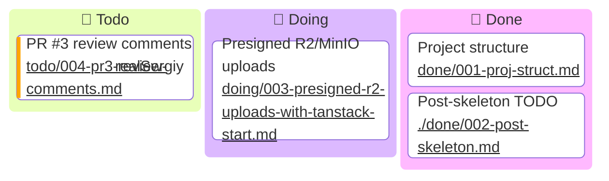

# Project Board

```mermaid
---
config:
  kanban:
    ticketBaseUrl: '#TICKET#'
---
kanban
  🌱 Todo
    [PR #3 review comments]@{ ticket: 'todo/004-pr3-review-comments.md', assigned: 'realSergiy', priority: 'High' }
  🌿 Doing
    [Presigned R2/MinIO uploads]@{ ticket: 'doing/003-presigned-r2-uploads-with-tanstack-start.md' }
  🌳 Done
    [Project structure]@{ ticket: 'done/001-proj-struct.md' }
    [Post-skeleton TODO]@{ ticket: './done/002-post-skeleton.md' }
```
