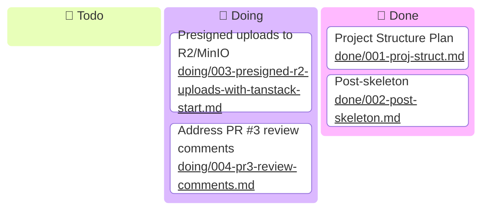

# Project Board

```mermaid
---
config:
  kanban:
    ticketBaseUrl: 'https://github.com/realSergiy/totvibe-ocr/blob/main/plan/board/#TICKET#'
---
kanban
  🌱 Todo
  🌿 Doing
    [Presigned uploads to R2/MinIO]@{ ticket: 'doing/003-presigned-r2-uploads-with-tanstack-start.md' }
    [Address PR #3 review comments]@{ ticket: 'doing/004-pr3-review-comments.md' }
  🌳 Done
    [Project Structure Plan]@{ ticket: 'done/001-proj-struct.md' }
    [Post-skeleton]@{ ticket: 'done/002-post-skeleton.md' }
```
