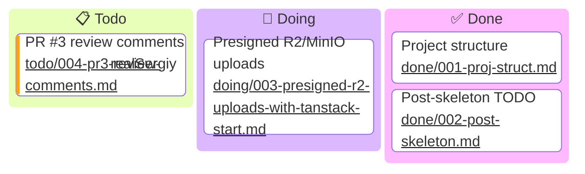

# Project Board

```mermaid
---
config:
  kanban:
    ticketBaseUrl: 'https://github.com/realSergiy/totvibe-ocr/blob/main/plan/board/#TICKET#'
---
kanban
  todo[📋 Todo]
    t004[PR #3 review comments]@{ ticket: 'todo/004-pr3-review-comments.md', assigned: 'realSergiy', priority: 'High' }
  doing[🚧 Doing]
    d003[Presigned R2/MinIO uploads]@{ ticket: 'doing/003-presigned-r2-uploads-with-tanstack-start.md' }
  done[✅ Done]
    n001[Project structure]@{ ticket: 'done/001-proj-struct.md' }
    n002[Post-skeleton TODO]@{ ticket: 'done/002-post-skeleton.md' }
```
