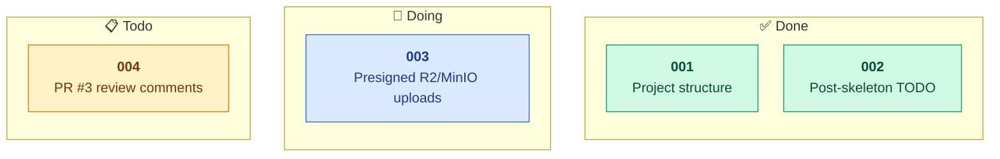

# Project Board

```mermaid
---
config:
  flowchart:
    htmlLabels: true
    nodeSpacing: 30
    rankSpacing: 40
  securityLevel: loose
---
flowchart LR
    subgraph TODO["📋 Todo"]
        direction TB
        T004["<b>004</b><br/>PR #3 review comments"]
    end

    subgraph DOING["🚧 Doing"]
        direction TB
        D003["<b>003</b><br/>Presigned R2/MinIO uploads"]
    end

    subgraph DONE["✅ Done"]
        direction TB
        N001["<b>001</b><br/>Project structure"]
        N002["<b>002</b><br/>Post-skeleton TODO"]
    end

    TODO ~~~ DOING ~~~ DONE

    classDef todo fill:#fef3c7,stroke:#d97706,color:#78350f
    classDef doing fill:#dbeafe,stroke:#2563eb,color:#1e3a8a
    classDef done fill:#d1fae5,stroke:#059669,color:#064e3b

    class T004 todo
    class D003 doing
    class N001,N002 done

    click T004 href "todo/004-pr3-review-comments.md" "Open 004"
    click D003 href "doing/003-presigned-r2-uploads-with-tanstack-start.md" "Open 003"
    click N001 href "done/001-proj-struct.md" "Open 001"
    click N002 href "done/002-post-skeleton.md" "Open 002"
```
