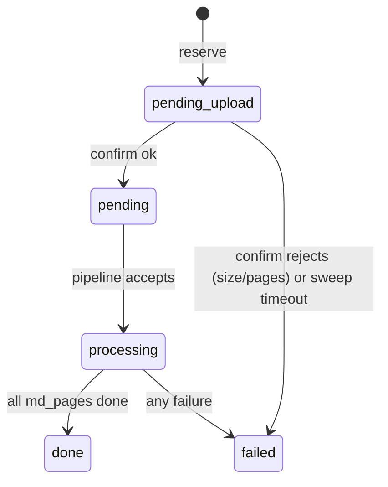

# Presigned uploads to R2/MinIO

Move raw PDF upload off the worker request path. Browser PUTs directly to object storage using a short-lived presigned URL; the worker only signs, validates, and records.

Storage backend is R2 in prod and MinIO in dev (S3-compatible, accessed via `S3_ENDPOINT` / path-style). Everything below has to work for both.

## Why

`POST /api/ocr-jobs` (`apps/web/src/server.ts:34`) currently buffers the entire PDF with `request.arrayBuffer()`, validates size + page count, then `PutObject`s it to S3. That hits four walls:

1. Cloudflare Workers cap request bodies at 100 MB on Free/Pro/Business.
2. Worker memory is 128 MB per invocation; buffering near the cap is unsafe.
3. The bytes pay an extra hop (browser → worker → S3) for no reason.
4. We can't progressively report upload progress when the bytes are tunnelled through the worker.

A presigned-PUT flow removes the worker from the data path. It only signs a permission slip; the browser uploads directly.

## Three-step flow

1. **Reserve.** Client calls `reserveUpload({ filename, contentType, size })` (TanStack `createServerFn`). Server validates, picks a ULID, inserts an `ocr_jobs` row in status `pending_upload`, returns `{ ocrJobId, uploadUrl, key }`.
2. **Upload.** Browser does `fetch(uploadUrl, { method: 'PUT', body: file })` directly to R2/MinIO.
3. **Confirm.** Client calls `confirmUpload({ ocrJobId })`. Server `HEAD`s the object for actual size, range-`GET`s the first ~1 MB to run `estimatePageCount`, deletes the object + fails the row if over `MAX_PDF_BYTES` or `MAX_PAGES`, otherwise flips status to `pending` and submits to the pipeline.

## Decisions

### Signing library: `aws4fetch`

Replace `@aws-sdk/client-s3` and `@aws-sdk/s3-request-presigner` in `apps/web` with `aws4fetch` for *all* S3 work — presign, PUT, GET, HEAD, range. Reasons:

- Built on Web APIs. No Node shims, no `aws-crt`, no SDK version churn.
- Bundle size: ~1 KB gzip vs. tens of KB tree-shaken from the AWS SDK. Material on Workers' bundle budget.
- One signing path for both presigned URLs and worker-side requests, instead of two.
- Cloudflare's own R2 docs recommend it as the Workers-native client.

`aws4fetch` accepts arbitrary endpoint URLs, so `S3_ENDPOINT` (MinIO) and the R2 virtual-host endpoint both work without code branching. Path-style for MinIO is just a URL shape.

### Object key shape

Stay deterministic: `ocr-jobs/{ocrJobId}/upload.pdf` (matches `blob.upload()` in `apps/web/src/lib/s3.ts:48`). The ULID is unguessable enough; we don't need UUID + filename suffix. Filename is kept as job metadata in the DO, not in the key.

### Limit enforcement

Worker no longer sees the bytes, so `MAX_PDF_BYTES` and `MAX_PAGES` move to *confirm* time:

- **Size:** `HEAD` the object after the client claims upload completion. Trust nothing the client said about size.
- **Pages:** range-`GET` the first ~1 MB and run `estimatePageCount(bytes)` (`apps/web/src/lib/pdf-pages.ts`). The current estimator scans the whole file but the page-count markers it looks for are concentrated near the start; we'll either confirm that or adjust the estimator to handle a head slice.
- If either check fails: delete the object via signed `DELETE`, mark the row `failed` with a clear error, broadcast.

Client-supplied `size` in the reserve call is *only* used for early UX rejection ("file too big") — never for trust-bearing decisions.

### Job lifecycle

New `ocr_jobs.status = 'pending_upload'`. State machine becomes:



`submitToPipeline` (`apps/web/src/durable-objects/user-do.ts:284`) moves from being called inside `createOcrJob` to being called at the end of `confirmUpload`. `md_pages` rows are also created on confirm, since `total_pages` isn't known until then.

### Orphan handling

The existing DO alarm (`apps/web/src/durable-objects/user-do.ts:62`) gets a second responsibility: sweep `pending_upload` rows older than `RECONCILE_TIMEOUT_SECONDS`. For each, attempt a signed `DELETE` (object may not exist — ignore 404), then mark the row `failed` with `error = 'upload abandoned'` and broadcast.

### Auth

No change. Still `DEFAULT_USER_ID`. Auth gating on the reserve endpoint is a separate future change.

### CORS

R2 bucket CORS rule (set via `wrangler r2 bucket cors put` in prod, or applied through `infra/` if we codify it):

```json
[
  {
    "AllowedOrigins": ["https://<prod-host>"],
    "AllowedMethods": ["PUT"],
    "AllowedHeaders": ["*"],
    "ExposeHeaders": ["ETag"],
    "MaxAgeSeconds": 3600
  }
]
```

For dev, MinIO needs the equivalent rule for `http://localhost:5173` (or whichever port). MinIO config lives in `infra/compose.dev.yaml` — we'll codify the CORS init there so it's reproducible.

### Don't sign `Content-Type`

`aws4fetch` with `signQuery: true` only signs `host` by default. If the browser sends a `Content-Type` header that wasn't signed, S3 rejects it. Two options:

- Easy: the browser PUT sends no `Content-Type`. The object is stored without one or with `application/octet-stream`; we already track the real content-type in the DO row.
- Stricter: sign `Content-Type` on the server and have the client send the matching header. We'll start with the easy path.

## Routing style: `createServerFn`, not Hono

The reserve and confirm endpoints are TanStack `createServerFn`s, not Hono routes. They live alongside the existing Hono `/api/*` routes — `startHandler` is already wired as the fallback (`apps/web/src/server.ts:157`), so server-fn calls are picked up there. Existing endpoints (`/api/ocr-jobs/:id/upload`, `/api/me/items`, websocket, pipeline callback) stay on Hono — this PR introduces a mixed routing style intentionally; full migration is a separate decision.

Server fns access bindings via `import { env } from 'cloudflare:workers'`. Validation uses `inputValidator(zodSchema.parse)`. The DO stub is fetched the same way Hono routes do today (`env.USER_DO.idFromName(DEFAULT_USER_ID)`).

```ts
// apps/web/src/server-fns/uploads.ts (sketch — final code may differ)
import { createServerFn } from '@tanstack/react-start';
import { env } from 'cloudflare:workers';
import { z } from 'zod';

const reserveSchema = z.object({
  filename: z.string().min(1).max(255),
  contentType: z.literal('application/pdf'),
  size: z.number().int().positive().max(MAX_PDF_BYTES),
});

export const reserveUpload = createServerFn({ method: 'POST' })
  .inputValidator(reserveSchema.parse)
  .handler(async ({ data }) => {
    // sign PUT URL, insert row in 'pending_upload', return { ocrJobId, uploadUrl, key }
  });

export const confirmUpload = createServerFn({ method: 'POST' })
  .inputValidator(z.object({ ocrJobId: OcrJobIdSchema }).parse)
  .handler(async ({ data }) => {
    // HEAD for size, range-GET for pages, fail or flip to 'pending' + submit
  });
```

The client invokes them as plain async functions (`await reserveUpload({ data: { ... } })`), not via `fetch`. No new Hono handlers, no new `/api/*` paths.

## Files to touch

- `apps/web/package.json` — add `aws4fetch`, drop `@aws-sdk/client-s3` and `@aws-sdk/s3-request-presigner`. Update workspace catalog.
- `apps/web/src/lib/s3.ts` — rewrite `fetchBlob`/`putBlob` against `aws4fetch`; add `headBlob`, `deleteBlob`, `signPutUrl`, and a range variant of `fetchBlob`.
- `apps/web/src/server-fns/uploads.ts` — new file. `reserveUpload` and `confirmUpload` server fns.
- `apps/web/src/server.ts` — remove `handleCreateOcrJob` and the `POST /api/ocr-jobs` route. Hono fallback still passes everything else (including server-fn calls) to `startHandler`.
- `apps/web/src/durable-objects/user-do.ts` — add `reserveUpload`, `confirmUpload`; refactor `createOcrJob` callers; extend `alarm` to sweep `pending_upload`.
- `apps/web/src/durable-objects/schema.ts` + `migrations.ts` — add `pending_upload` to the status enum.
- `apps/web/src/routes/index.tsx` — switch the `upload` callback to call `reserveUpload`/`confirmUpload` directly (no `fetch`).
- `apps/web/src/lib/pdf-pages.ts` — confirm/adjust for head-slice operation.
- `apps/web/src/constants.ts` — keep `MAX_PDF_BYTES`/`MAX_PAGES`; possibly add `UPLOAD_RESERVATION_TTL_SECONDS`.
- Tests: add coverage for the reserve/confirm split, oversize rejection on confirm, and the orphan sweep.

## Pre-prod checklist

- [ ] R2 credentials stored as Wrangler secrets, not in `wrangler.jsonc`.
- [ ] `MAX_PDF_BYTES` enforced in confirm via `HEAD`, not just trusted from the client.
- [ ] `MAX_PAGES` enforced in confirm via range-GET + `estimatePageCount`.
- [ ] Object keys derive from server-issued ULID; client never controls the key.
- [ ] CORS rules restrict `AllowedOrigins` to actual deployed hosts.
- [ ] Presigned PUT TTL ≤ 15 minutes.
- [ ] Filename sanitization happens server-side before any echo back (it's not in the key, but it goes into the DO row).
- [ ] Orphan sweep tested by leaving a `pending_upload` row past the alarm window.
- [ ] MinIO CORS codified in `infra/compose.dev.yaml`.

## References

- [Cloudflare R2 — presigned URLs](https://developers.cloudflare.com/r2/api/s3/presigned-urls/)
- [`aws4fetch` on npm](https://www.npmjs.com/package/aws4fetch)
- [Cloudflare Durable Objects limits](https://developers.cloudflare.com/durable-objects/platform/limits/)
