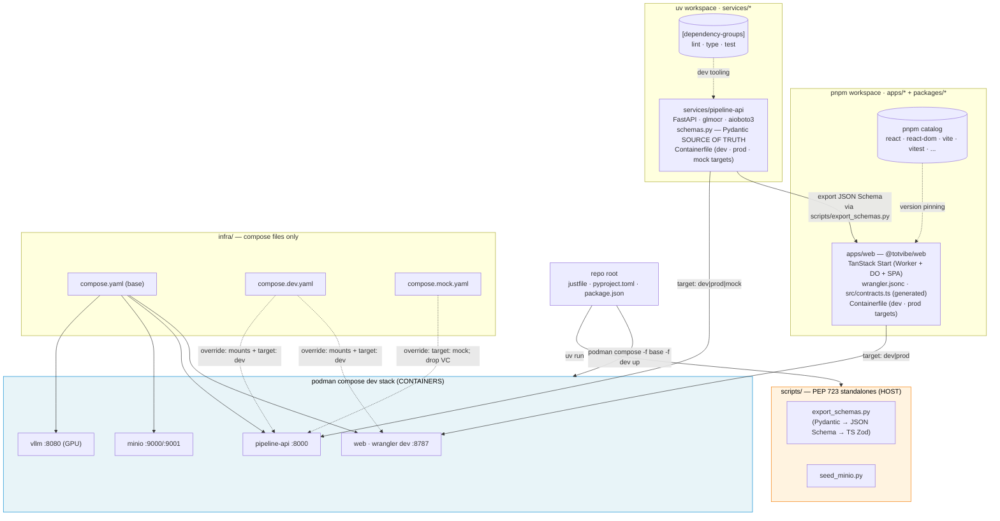

# Totvibe-OCR — Project Structure Plan

> **Status:** v0.1 scaffolded — readiness 100%
> **Last updated:** 2026-05-06
> **Walking skeleton:** A repo where `just install` syncs both lockfiles (uv + pnpm) on the host plus builds the app images, and `just dev` runs `podman compose -f infra/compose.yaml -f infra/compose.dev.yaml up` to bring up the TanStack Start Worker (wrangler dev in a container), the Python pipeline (uvicorn in a container), and stateful deps (MinIO + vLLM) — all under one supervisor. Variants (`dev`, `mock`, `test`, future `prod-like`) are compose override files. `scripts/` holds Python 3.14 PEP 723 helper scripts that run on the host via `uv run` for codegen and one-off ops.

This document is the companion to [`totvibe-ocr.md`](./totvibe-ocr.md). The architecture is settled there. This file decides **only** how the code is laid out on disk: workspaces, package boundaries, where things live, how they're built and run, and how cross-language contracts are kept in sync.

## 1. Vision
A poly-language monorepo (TypeScript + Python) that feels like one project. Modern 2026 tooling: **pnpm 10.26.1 workspaces with catalogs** for TS, **uv workspaces** for Python, a single root `justfile` that orchestrates everything by delegating to `podman compose`, and a `scripts/` directory of self-contained PEP 723 helper scripts (Python 3.14, inline deps via `uv run`). All long-running services run in podman containers; codegen and one-off ops run on the host via `uv run`. Extensible from day 1 — adding a second TS app, a second Python service, or a second compose variant should be a folder copy + a single config edit, not a refactor.

## 2. Problem & motivation
Mixed TS/Python projects historically force a choice between two bad shapes: (a) two separate repos kept in lockstep manually, or (b) one repo with ad-hoc scripts and no clean dependency story per language. As of 2026, both ecosystems have first-class workspace tooling (uv 0.4+ for Python, pnpm 10+ catalogs for TS), and `just` + PEP 723 + `podman compose` together give a clean orchestration layer above them. The project needs a structure that:
- Lets the TS edge layer and the Python pipeline evolve independently while sharing the repo.
- Makes the dev loop a single command that brings up everything together (no "did you start vLLM?" / "did you start the pipeline?" footguns).
- Centralizes operational scripts (DB seed, schema codegen, container management, dev fixtures) without polluting either workspace.
- Makes the cross-language contract (callback payloads) a tracked, codegened artifact, not folklore.
- Survives growth: adding `apps/admin`, `packages/contracts` (TS-shared), `services/pipeline-shared` (Python-shared), or a new compose variant later is mechanical.

## 3. Users & primary scenarios
- Primary user: **the author**, working from a laptop with both `uv` and `pnpm` installed on the host, plus podman with the NVIDIA Container Toolkit. `just <recipe>` for everyday tasks. [DECIDED]
- Key scenarios:
  - `just install` — host-side: `pnpm install` + `uv sync --all-packages`. Then `podman compose build` for app images. [DECIDED]
  - `just dev` — `podman compose -f infra/compose.yaml -f infra/compose.dev.yaml up` — wrangler dev + pipeline-api + MinIO + vLLM all come up together; Ctrl-C shuts them all down. [DECIDED]
  - `just dev-mock` — `podman compose -f infra/compose.yaml -f infra/compose.mock.yaml up` — substitutes the mock pipeline target for the real one and skips vLLM (no GPU needed). [DECIDED]
  - `just up` / `just down` — passthrough to compose for the same dev stack. [DECIDED]
  - `just build [service]` — passthrough to `podman compose build`. [DECIDED]
  - `just test` — runs vitest (TS) and pytest (Python) on the host (fast inner loop) — containerized test variant lives in a future `compose.test.yaml`. [DECIDED]
  - `just codegen` — runs `uv run scripts/export_schemas.py` on the host (PEP 723; no workspace deps). [DECIDED]
  - Adding a one-off ops script: drop `scripts/foo.py` with PEP 723 deps, run via `uv run scripts/foo.py` (or `just foo`). [DECIDED]

## 4. Goals
- **One root, two workspaces, one compose stack.** A virtual `pyproject.toml` at root for the uv workspace; a root `package.json` + `pnpm-workspace.yaml` for the pnpm workspace; a base `infra/compose.yaml` + override files for the dev/mock/test variants. They coexist; none owns the others. [DECIDED]
- **`apps/*` + `packages/*` layout** for TS (TanStack Start app under `apps/`, future shared libs under `packages/`). [DECIDED]
- **`services/*` layout** for Python (pipeline service is `services/pipeline-api`; future Python services and libs drop in alongside). Kept disjoint from `packages/*` so pnpm and uv globs never overlap. [DECIDED]
- **Container-native dev loop.** All long-running services (web, pipeline-api, MinIO, vLLM) run in podman, orchestrated by compose. Variant compose files (`compose.dev.yaml`, `compose.mock.yaml`, future `compose.test.yaml`, future `compose.prod-like.yaml`) are merged on top of the base via explicit `-f` flags. [DECIDED]
- **Containerfiles colocated with each package they build.** `apps/web/Containerfile` and `services/pipeline-api/Containerfile` — multi-stage so dev/prod (and `mock` for pipeline-api) targets live in one file per package. `infra/` holds **only** compose files. [DECIDED]
- **Host runs only short-lived tooling.** Codegen, helper scripts, IDE/LSP type-check passes, and the test runners run on the host. The host has `pnpm`, `uv`, `node`, `python 3.14`, and `podman` installed; nothing more. [DECIDED]
- **`scripts/` for PEP 723 helpers** — self-contained `# /// script` files, no workspace membership, no shared deps. Run on the **host** via `uv run scripts/<name>.py` (or `just <name>`). [DECIDED]
- **Single root `justfile`** as the entry point for every common task. Child justfiles inside `apps/*`, `packages/*`, and `services/*` allowed when local-only recipes accumulate; root recipes always callable from anywhere via `just <recipe>`. [DECIDED]
- **Single source of truth for cross-language contracts** — Pydantic models in the pipeline service, codegen to TS Zod schemas + inferred types via JSON Schema → quicktype. Generated file committed at `apps/web/src/contracts.ts`. [DECIDED]
- **Lockfiles checked in, both at root.** `uv.lock` (root, single, covers all members) + `pnpm-lock.yaml` (root, single). [DECIDED]
- **No top-level `src/`.** Every package owns its own `src/` (Python `src/<pkg>/...` layout; TS `src/...` per app). [DECIDED]

## 5. Non-goals (current scope)
- Nx / Turborepo / Lerna / Moon / Bazel — unnecessary for a 1-app + 1-service repo; pnpm + uv + just + podman compose is enough. Revisit if the TS workspace grows past ~5 packages or build-graph caching becomes a bottleneck. [DECIDED]
- A polyglot single-tool runner (mise, hermit, devenv) — `just` + `uv` + `pnpm` covers it without another layer. [DECIDED]
- Host-only dev workflow — everything routes through `podman compose`. The host runs codegen + helper scripts + IDE-side type-check + tests, but **not** the long-running services. [DECIDED]
- A separate `packages/types` lib in the TS workspace just for in-app types — the TanStack Start app is one package; SPA and Worker share types intra-package. A `packages/contracts` package only appears if a *second* TS package needs the cross-language types. [DECIDED]
- Bun as the package manager — pnpm 10.26.1 chosen. [DECIDED]
- Vendoring `glmocr` into the workspace — it's a published SDK, treat as a normal dep of `pipeline-api`. [DECIDED]
- VS Code dev containers (devcontainer.json) — host tools + compose stack already cover the loop without an extra abstraction. [DECIDED]
- A separate prod compose stack in v0.1 — production deploys are CF Workers (no compose) and (eventually) a managed GPU host. `compose.prod-like.yaml` may appear in v1 for end-to-end prod-shape rehearsal but isn't needed yet. [DECIDED]
- Multiple Containerfiles per package (e.g. `Containerfile.dev` + `Containerfile.prod`) — single multi-stage `Containerfile` per package; compose `target:` selects the stage. [DECIDED]

## 6. Constraints
- **Hard tech constraints from `totvibe-ocr.md`:** TanStack Start (Cloudflare adapter), Cloudflare Workers + DO with embedded SQLite, Vite, React 19, FastAPI on uvicorn, `glmocr[selfhosted]` SDK, paddlepaddle-gpu, vLLM, MinIO/R2, podman.
- **Hard tooling constraints from the user:**
  - `justfile` at the repo root.
  - `scripts/` dir for helper scripts in **Python 3.14, PEP 723** inline-deps format, **host-run** (not in containers).
  - Python managed via **uv workspaces**.
  - TypeScript managed via **pnpm 10.26.1 workspaces with catalogs** (pinned via `packageManager` in root `package.json`; corepack-enabled).
  - **Everything starts with `podman compose up`** — multiple compose files (base + override) for variants (dev / mock / test / future prod).
- **`wrangler.jsonc`** must live next to `apps/web/package.json` (Cloudflare's adapter expects this; workspaces don't change it).
- **TanStack Start since v1.121 (June 2025) is one Vite build** — splitting Worker entry from React UI into separate packages defeats the framework. The app is necessarily one package.
- **uv lockfile is workspace-wide** — `uv lock` always operates on the whole workspace, single `uv.lock` at the root.
- **Python 3.14** for both helper scripts and workspace members (consistency; no mixed-version split).
- **Node 22 LTS** pinned via `.nvmrc` for host-side tooling.

## 7. Functional requirements (of the structure itself)
1. Cloning the repo and running `just install` produces a working dev environment: `pnpm install` + `uv sync --all-packages` (host-side, for IDE/LSP and tests) and `podman compose build` (caches dev images). [DECIDED]
2. `just dev` runs `podman compose -f infra/compose.yaml -f infra/compose.dev.yaml up` and Ctrl-C shuts everything down cleanly. [DECIDED]
3. `just dev-mock` runs `podman compose -f infra/compose.yaml -f infra/compose.mock.yaml up` (substitutes the mock pipeline target; drops vLLM). [DECIDED]
4. The pipeline service is buildable via `podman compose build pipeline-api` and runnable via the dev compose. Direct host invocation (`uv run --package pipeline-api uvicorn ...`) still works for ad-hoc debugging but is not the primary dev loop. [DECIDED]
5. The TanStack Start app is buildable via `podman compose build web` and runnable via the dev compose. Direct host invocation (`pnpm --filter @totvibe/web dev`) still works for ad-hoc debugging but is not the primary dev loop. [DECIDED]
6. Helper scripts in `scripts/` run on the **host** as `uv run scripts/<name>.py` regardless of cwd; their PEP 723 metadata declares Python 3.14 + their own deps; they MUST NOT depend on workspace state. [DECIDED]
7. `just <name>` recipes exist for at least: `install`, `dev`, `dev-mock`, `up`, `down`, `build`, `test`, `lint`, `format`, `typecheck`, `codegen`, `clean`. (`build` covers `podman compose build`.) [DECIDED]
8. Cross-language contract types are codegened: Pydantic source-of-truth in `pipeline_api/schemas.py` → JSON Schema → Zod TS in `apps/web/src/contracts.ts`. `just codegen` runs the script; the generated file is committed. [DECIDED]
9. Adding a second Python service: `mkdir services/foo-svc`, `uv init`, the existing `[tool.uv.workspace] members = ["services/*"]` glob picks it up automatically, write `services/foo-svc/Containerfile`, add a service entry to `infra/compose.yaml`. [DECIDED]
10. Adding a second TS package: `mkdir packages/<name>`, `pnpm init`, the existing `packages/*` glob in `pnpm-workspace.yaml` picks it up. (No new compose entry unless it's a long-running service; if it is, add a colocated `Containerfile`.) [DECIDED]
11. Adding a new compose variant (e.g. `compose.staging.yaml`): drop the file in `infra/`, add a `just <variant>` recipe to the root justfile. [DECIDED]
12. CI (when it lands post-v0.1) sees a single repo with two workspaces and a compose stack; `just ci` is the entry point. [PROPOSED — see §13]

## 8. Walking skeleton (v0.1 / MVP layout)

The minimum tree that runs the v0.1 walking skeleton from `totvibe-ocr.md`:

```text
totvibe-ocr/
├── justfile                          # root recipes — orchestrates pnpm + uv + podman compose
├── pyproject.toml                    # uv workspace virtual root
├── uv.lock                           # the only Python lockfile
├── package.json                      # pnpm workspace root + catalog deps + packageManager: pnpm@10.26.1
├── pnpm-workspace.yaml               # workspace globs + named catalogs
├── pnpm-lock.yaml                    # the only TS lockfile
├── .python-version                   # 3.14
├── .nvmrc                            # 22
├── .gitignore
├── README.md
│
├── plan/                             # this brainstorming corpus
├── scripts/                          # PEP 723 helper scripts (Python 3.14, inline deps, HOST-RUN via `uv run`)
│   ├── export_schemas.py             # Pydantic → JSON Schema → emits TS Zod via quicktype
│   ├── seed_minio.py                 # ad-hoc MinIO bucket / fixture seeding
│   └── ...
│
├── infra/                            # compose files only (Containerfiles live with their packages)
│   ├── compose.yaml                  # base: minio · vllm · web · pipeline-api (image refs only)
│   ├── compose.dev.yaml              # dev override: bind mounts, hot reload, target: dev
│   ├── compose.mock.yaml             # mock override: pipeline-api uses target: mock; drops vllm
│   └── compose.test.yaml             # test override (future)
│
├── apps/
│   └── web/                          # TanStack Start app (Worker + DO + SPA — one package, one Vite build)
│       ├── package.json              # name: @totvibe/web
│       ├── wrangler.jsonc            # CF Worker config + DO bindings + migrations
│       ├── vite.config.ts            # uses @cloudflare/vite-plugin + tanstackStart()
│       ├── tsconfig.json
│       ├── Containerfile             # multi-stage: dev (wrangler dev) · prod (vite build → CF deploy artifact)
│       ├── .dockerignore
│       ├── eslint.config.js
│       ├── prettier.config.js        # (or .prettierrc — see §10)
│       ├── src/
│       │   ├── server.ts             # custom server entry; re-exports DO classes
│       │   ├── routes/               # TanStack Router file routes (server fns + components colocated)
│       │   ├── durable-objects/
│       │   │   ├── user-do.ts
│       │   │   └── user-do.sql       # schema string colocated with the class
│       │   ├── lib/                  # shared utils across SPA + Worker
│       │   ├── client/               # SPA-only: TanStack DB collection, components
│       │   └── contracts.ts          # GENERATED from services/pipeline-api/src/pipeline_api/schemas.py
│       └── worker-configuration.d.ts # generated by `wrangler types`
│
├── packages/                         # TS shared libs only (pnpm workspace)
│                                     # (empty in v0.1; first occupant will be `packages/contracts` if a 2nd TS pkg ever needs the codegened types)
│
└── services/                         # Python workspace members (uv workspace)
    └── pipeline-api/                 # FastAPI pipeline service
        ├── pyproject.toml            # name: pipeline-api
        ├── Containerfile             # multi-stage: dev (uvicorn --reload) · prod (uvicorn) · mock (--mock)
        ├── .dockerignore
        ├── src/
        │   └── pipeline_api/
        │       ├── __init__.py
        │       ├── __main__.py       # `python -m pipeline_api` (supports --mock)
        │       ├── app.py            # FastAPI app factory
        │       ├── routes.py         # /submit, /jobs/<id>, /healthz
        │       ├── ocr.py            # glmocr SDK calls (real path)
        │       ├── storage.py        # aioboto3 S3 client
        │       ├── callbacks.py      # outbound POST to Worker
        │       ├── schemas.py        # Pydantic models — SOURCE OF TRUTH for cross-lang contracts
        │       ├── persistence.py    # aiosqlite for crash recovery
        │       └── mock.py           # --mock flag implementation: canned per-page callbacks; same routes, no glmocr/paddle calls
        └── tests/
```

**Multi-stage Containerfile pattern (apps/web/Containerfile, sketch in prose):**

- `FROM node:22-slim AS base` — install pnpm via corepack.
- `AS deps` — copy lockfile + workspace manifests, run `pnpm install --frozen-lockfile`.
- `AS dev` — copy source, expose 8787, `CMD ["pnpm", "wrangler", "dev", "--ip", "0.0.0.0"]`. Compose's `compose.dev.yaml` selects `target: dev` and bind-mounts `./apps/web/src` for hot reload.
- `AS prod` — `pnpm build`, output the deployable Worker artifact. Used by future `compose.prod-like.yaml` and CI build.

**Multi-stage Containerfile pattern (services/pipeline-api/Containerfile, sketch in prose):**

- `FROM python:3.14-slim AS base` — install uv.
- `AS deps` — copy `uv.lock` + workspace `pyproject.toml`s, run `uv sync --frozen --package pipeline-api`.
- `AS dev` — copy source, `CMD ["uv", "run", "--package", "pipeline-api", "uvicorn", "pipeline_api.app:app", "--host", "0.0.0.0", "--port", "8000", "--reload"]`. Includes glmocr + paddle.
- `AS prod` — same as `dev` minus `--reload`, plus the GPU-aware paddle wheel.
- `AS mock` — slim variant: `CMD ["uv", "run", "--package", "pipeline-api", "python", "-m", "pipeline_api", "--mock"]`. The `--mock` flag in `pipeline_api/__main__.py` swaps in `mock.py`'s canned-callback handler instead of the real OCR path; the heavy deps (glmocr, paddle) are still in the image but never imported under `--mock`.

**What's deliberately NOT in v0.1:**
- No `packages/contracts` TS lib — `apps/web/src/contracts.ts` is enough until a 2nd TS package needs the same types.
- No `services/pipeline-shared` Python lib — `pipeline-api` and the mock share code intra-package via `mock.py`.
- No CI config — comes after v0.1 manual proof.
- No `compose.prod-like.yaml` — production deploys are CF Workers (no compose) until v1's GPU host lands.
- No per-app justfiles — root justfile is enough at this size; split when local recipes accumulate.
- No devcontainer.json — host tools + compose stack cover the loop.
- No separate `Containerfile.mock` for the mock pipeline — same multi-stage `Containerfile`, different `target`.

## 9. Layout sketch — relationships



Three coexisting dev contexts:
- **Host** runs the package managers (pnpm, uv) for IDE/LSP/tests, plus PEP 723 scripts.
- **Container stack** (podman compose) runs every long-running service (web, pipeline-api, minio, vllm).
- **Compose variants** (dev / mock / test) layer overrides on a single base file, selecting Containerfile targets per service.

The codegen arrow is one-way: Python schemas → TS types (committed).

## 10. Tech stack — decisions per layer
- **TS package manager:** **pnpm 10.26.1**, pinned via `"packageManager": "pnpm@10.26.1"` in root `package.json` (corepack-enabled). Catalogs declared in `pnpm-workspace.yaml`. [DECIDED]
- **Python package manager:** **uv** with `[tool.uv.workspace]` virtual root. PEP 735 `[dependency-groups]` for cross-cutting dev tooling at the root. [DECIDED]
- **Workspace shape (TS):** `apps/*` + `packages/*`. [DECIDED]
- **Workspace shape (Python):** `services/*` only (services and libs share the directory; differentiated by `[project.scripts]` presence). Disjoint from the TS `packages/*` glob so pnpm and uv can never disagree about who owns a directory. [DECIDED]
- **Task runner:** `just` (root `justfile`, child `justfile`s allowed later). [DECIDED]
- **Dev orchestration:** `podman compose -f infra/compose.yaml -f infra/compose.<variant>.yaml up`. Just delegates; podman is the supervisor. [DECIDED]
- **Compose variant strategy:** base `compose.yaml` + per-variant override files (`compose.dev.yaml`, `compose.mock.yaml`, future `compose.test.yaml`, `compose.prod-like.yaml`). Explicit `-f` flags rather than the auto-loaded `compose.override.yaml`, for clarity in justfile recipes. [DECIDED]
- **Containerfile placement:** **colocated** with each package (`apps/web/Containerfile`, `services/pipeline-api/Containerfile`). One multi-stage Containerfile per package; compose `target:` selects the stage. `infra/` holds **only** compose files. [DECIDED]
- **Mock pipeline:** **`--mock` flag inside `pipeline-api`**, implemented in `mock.py` and exposed via `__main__.py`. Built as the `mock` stage of `services/pipeline-api/Containerfile`. No separate Python package, no separate Containerfile. [DECIDED]
- **Helper scripts:** Python 3.14, PEP 723 inline deps, run on the **host** via `uv run scripts/<name>.py`. No shared deps; each script self-contained. [DECIDED]
- **Container runtime:** podman + podman-compose. [DECIDED]
- **Cross-language contract:** Pydantic v2 in `pipeline_api/schemas.py` → JSON Schema (via `model_json_schema()`) → TS Zod schemas + inferred types in `apps/web/src/contracts.ts`, generated by `scripts/export_schemas.py` (which calls quicktype or `json-schema-to-zod`). Generated file committed. [DECIDED]
- **Linting / formatting:**
  - Python: `ruff` (lint + format), `ty` for type-check (mypy as fallback) — under root `[dependency-groups]`. [DECIDED]
  - TS: **eslint + prettier**. Familiar, mature, plugin-rich; configs at the root for shared rules with per-app overrides. [DECIDED]
- **Test runners:**
  - TS: vitest + RTL + jsdom (per `totvibe-ocr.md`). [DECIDED]
  - Python: pytest + pytest-asyncio. [DECIDED]
- **Lockfiles:** `uv.lock` and `pnpm-lock.yaml`, both at root, both committed. [DECIDED]
- **Node version pinning:** `.nvmrc` set to `22`. [DECIDED]
- **Python version pinning:** `.python-version` set to `3.14`; uv reads it. [DECIDED]

## 11. Roadmap
- **v0.1 (this plan):** layout above is enough for the v0.1 walking skeleton in `totvibe-ocr.md`. Single TS app, single Python service, root justfile, scripts/, infra/ with compose files, two colocated multi-stage Containerfiles.
- **v0.5:** `compose.prod-like.yaml` for full-stack rehearsal before CF deploy. CI config (`.github/workflows/`) lands; `just ci` recipe materializes. `compose.test.yaml` if integration tests need a containerized fixture stack. Possibly a per-app justfile if `apps/web` accumulates >5 local recipes.
- **v1:** likely `services/pipeline-shared` Python lib if a second pipeline variant (cloud GPU host) is added alongside `pipeline-api`. The cloud-GPU pipeline gets its own colocated Containerfile and its own compose entry.
- **v2+:** if the TS workspace grows past ~5 packages or build-graph caching becomes a bottleneck, evaluate Turborepo or Moon. Until then, `pnpm -r` is enough.

## 12. Decisions log
- **One repo, two workspaces, one compose stack, one justfile** (not Nx, not Bazel, not a polyglot meta-tool) — chosen for minimum tooling overhead at the v0.1 / v0.5 size; the layout is mechanical to grow from.
- **TanStack Start = one TS package** — not split into Worker + SPA packages; the framework is one Vite build since v1.121.
- **`scripts/` is for PEP 723 standalones, host-run** — clarified by user 2026-05-06; helper scripts must not depend on workspace state and never run inside the dev compose stack.
- **`apps/*` + `packages/*` for TS, `services/*` for Python (round-4 rename, post-scaffold 2026-05-06)** — initial round-3 decision had Python sharing `packages/*` with TS-shared libs, relying on each tool keying off its own manifest (`package.json` for pnpm, `pyproject.toml` for uv) to disambiguate. After scaffolding completed, a polyglot-monorepo research pass surfaced two issues: (a) **uv requires every dir matched by `[tool.uv.workspace] members` globs to contain `pyproject.toml`** — a future TS-only `packages/contracts` would error `uv lock` unless explicitly excluded, asymmetric with pnpm which silently tolerates Python-only dirs; (b) shared `packages/` is *tolerated but uncommon* in 2026 polyglot monorepos — no widely-cited public repo combines pnpm + uv under a single `packages/*` glob, and the language-segregated layout matches the more common convention (Julien Barbay's polyglot post; create-polyglot scaffolder; Nx + @nxlv/python). Cost during scaffolding was ~5 min: rename one directory + 6 path edits across `pyproject.toml`, `infra/compose*.yaml`, `services/pipeline-api/Containerfile`, `scripts/export_schemas.py`, `apps/web/src/contracts.ts`, `justfile`. Doing it now is much cheaper than after `packages/contracts` (TS-shared) and `services/pipeline-shared` (Python-shared) land.
- **Lockfiles at root only** — both uv and pnpm produce a single workspace-wide lockfile; no per-package locks.
- **Container-native dev (round-2 pivot, 2026-05-06):** `just dev` is `podman compose up`. Wrangler dev and uvicorn run **in containers**, not on the host. Variants via override files. Per-package Containerfiles are first-class. **Trade-off accepted:** wrangler dev in a container has bind-mount + hot-reload + miniflare-state friction (see §14); user prioritizes single-command dev start over native CF tooling ergonomics.
- **pnpm 10.26.1 over Bun (round-2):** chosen for CF Workers + TanStack Start ecosystem alignment; pinned via `packageManager` field.
- **Pydantic SOT → JSON Schema → Zod TS codegen (round-2):** committed file, single direction, `just codegen` recipe. Hand-maintaining 5 shapes twice was the alternative; codegen wins for drift safety.
- **Containerfiles colocated, multi-stage (round-3):** Containerfile lives next to each package's manifest (`apps/web/Containerfile`, `services/pipeline-api/Containerfile`). One file per package with multiple stages (`dev`, `prod`, plus `mock` for pipeline-api). Compose `target:` selects the stage. `infra/` stays compose-only. Centralized `infra/<name>.Containerfile` was the alternative; colocation matches Docker convention and simplifies build context.
- **Mock pipeline as `--mock` flag (round-3):** `mock.py` lives inside `pipeline-api`; the `mock` Containerfile stage just sets a different `CMD`. Heavier image (glmocr/paddle still present but not imported under `--mock`) accepted as the cost of avoiding a separate package and route-signature drift.
- **TS lint = eslint + prettier (round-3):** familiarity and plugin breadth over Biome's speed. Configs at root with per-app overrides.

## 13. Open questions
*All previously open questions are resolved. The remaining `[PROPOSED]` item (§7 #12, `just ci`) is a v0.5 concern, not v0.1. Implementation-time questions (exact compose service definitions, named-volume vs bind-mount details for hot reload, eslint config specifics) naturally resolve at code time and don't block this plan.*

## 14. Known unknowns
- **Wrangler dev inside a container** — bind-mount semantics for hot reload, `.wrangler/state/` persistence (DO state across restarts), port forwarding to the host browser, `wrangler login` flow. Doable, with examples in the wild, but not the documented CF path. Likely friction in v0.1 — possibly the single biggest implementation risk.
- **pnpm node_modules + container bind mounts** — pnpm's symlink-heavy structure can be slow or break on bind mounts. May need a named volume for `node_modules`, or `node-linker=hoisted` in `.npmrc` for the container.
- **uv `.venv/` portability** between host (used by IDE/LSP) and container (used by uvicorn) — Python ABI matching matters; safest path is to use a named volume in the container and not share the host `.venv`.
- **GPU passthrough for vLLM in podman compose** — works (NVIDIA Container Toolkit + `--device nvidia.com/gpu=all` or `runtime: nvidia`) but is fiddly per-distro and per-compose-version.
- **`uv run --package pipeline-api` ergonomics** when the primary dev path is containers — the host install exists for IDE/LSP, but the venv may go stale relative to the container if deps drift between rebuilds. Possibly add a `just sync` recipe that does both.
- **Pydantic v2 → JSON Schema → quicktype output cleanliness** for daily TS use, or whether it needs a post-process pass (e.g. for `Optional[T]` → `T | null` vs `T?` conventions).
- **Mock-stage image size** — keeping glmocr + paddle in the `mock` stage's dep tree (just unused) inflates the image. If it bites in CI, split to a separate `services/pipeline-mock` package as a v0.5 fix.
