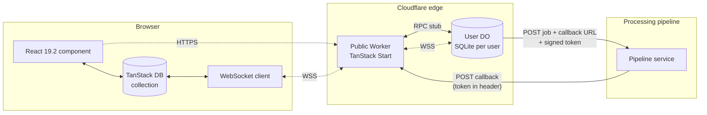

# Implementation Idea: User-Sharded Durable Objects as Primary Datastore with External Pipeline Callbacks

## TL;DR

Each user gets one Durable Object addressed by `idFromName(userId)`. That DO's embedded SQLite database is the single source of truth for that user's data — no Postgres in the system. Browser tabs hold a TanStack DB collection that is hydrated from the DO over an HTTP fetch and kept live via a hibernation-aware WebSocket back to the same DO. When a mutation kicks off an external processing pipeline, the DO writes a `pending` row, broadcasts it to all open tabs (instant optimistic-feeling UI), and submits the job to the external service with a callback URL containing a signed token that encodes the user identity and job id. When the pipeline finishes, it POSTs to that URL on the public Worker; the Worker verifies the token, routes the call into the correct user's DO via RPC, the DO updates the row, broadcasts the delta over the same WebSocket, and the live query in TanStack DB re-renders the affected component.

## High-level architecture



The Worker is intentionally thin: TLS termination, auth, request routing, callback verification. All durable state and all real-time fanout live inside the User DO. The pipeline never sees Postgres because there isn't one, and never sees the DO directly because DOs are not internet-routable; it only sees a stable Worker URL plus an opaque token.

## Data ownership and DO identity

The unit of sharding is the user. `env.USER_DO.idFromName(userId)` produces a deterministic DO id from a user id string, so any Worker request that has authenticated the user can address that user's DO without storing a mapping. This is the key reason the architecture works without Postgres — the DO id *is* derived from the user id, so the routing table is implicit.

Anything that does not naturally belong to a single user (cross-user analytics, admin dashboards, billing rollups) must be handled separately: either by a small set of "aggregate" DOs that subscribe to events, or by exporting to R2 and querying with an external engine. This document scopes itself to per-user data only; aggregate paths are listed under Open Questions.

## DO storage schema

A minimal schema for a generic "jobs go through a pipeline and come back with a result" model. Adapt the column names to the actual domain.

```sql
CREATE TABLE IF NOT EXISTS items (
  id          TEXT PRIMARY KEY,
  kind        TEXT NOT NULL,
  payload     TEXT NOT NULL,
  status      TEXT NOT NULL CHECK (status IN ('draft','pending','running','complete','failed')),
  result      TEXT,
  error       TEXT,
  pipeline_id TEXT,
  created_at  INTEGER NOT NULL,
  updated_at  INTEGER NOT NULL
);

CREATE INDEX IF NOT EXISTS idx_items_status_updated
  ON items(status, updated_at DESC);

CREATE TABLE IF NOT EXISTS callbacks_seen (
  callback_id TEXT PRIMARY KEY,
  seen_at     INTEGER NOT NULL
);
```

The `callbacks_seen` table exists because the pipeline will retry callbacks on transient failure and the same callback id must never be applied twice — see the idempotency section below.

A DO migration table (or KV-stored version number in `ctx.storage`) tracks schema version so the constructor can run `ALTER TABLE` migrations lazily on first wake after deploy. Migrations are per-DO and are applied the next time each user's DO is touched, which means a deploy doesn't have to migrate millions of databases at once.

## Durable Object class

Sketch of the User DO. RPC methods are the public surface; `webSocket*` are the hibernation handlers.

```ts
import { DurableObject } from 'cloudflare:workers'
import { z } from 'zod'

type Op = { op: 'insert' | 'update' | 'delete'; row: Record<string, unknown> }

export class UserDO extends DurableObject<Env> {
  private sql: SqlStorage

  constructor(ctx: DurableObjectState, env: Env) {
    super(ctx, env)
    this.sql = ctx.storage.sql
    ctx.blockConcurrencyWhile(async () => {
      await this.migrate()
    })
  }

  async listItems() {
    return this.sql.exec(`SELECT * FROM items ORDER BY updated_at DESC`).toArray()
  }

  async createItem(input: { kind: string; payload: unknown }) {
    const id = crypto.randomUUID()
    const now = Date.now()
    const row = {
      id,
      kind: input.kind,
      payload: JSON.stringify(input.payload),
      status: 'pending',
      result: null,
      error: null,
      pipeline_id: null,
      created_at: now,
      updated_at: now,
    }
    this.sql.exec(
      `INSERT INTO items (id,kind,payload,status,created_at,updated_at)
       VALUES (?,?,?,?,?,?)`,
      id, row.kind, row.payload, row.status, now, now,
    )
    this.broadcast({ op: 'insert', row })

    // Fire-and-forget submit; pipeline confirms via callback.
    this.ctx.waitUntil(this.submitToPipeline(id))
    return row
  }

  async handleCallback(msg: {
    callbackId: string
    itemId: string
    status: 'complete' | 'failed'
    result?: unknown
    error?: string
  }) {
    // Idempotency: the pipeline may retry. callback_id is unique per delivery attempt
    // from the pipeline's perspective, but we treat the *item completion* as the unit
    // of idempotency by storing it. If we've seen it, no-op silently with success.
    const seen = this.sql
      .exec(`SELECT 1 FROM callbacks_seen WHERE callback_id = ?`, msg.callbackId)
      .toArray()
    if (seen.length) return { ok: true, deduped: true }

    const now = Date.now()
    this.sql.exec(
      `UPDATE items
         SET status = ?, result = ?, error = ?, updated_at = ?
       WHERE id = ?`,
      msg.status,
      msg.result ? JSON.stringify(msg.result) : null,
      msg.error ?? null,
      now,
      msg.itemId,
    )
    this.sql.exec(
      `INSERT INTO callbacks_seen (callback_id, seen_at) VALUES (?, ?)`,
      msg.callbackId, now,
    )

    const updated = this.sql
      .exec(`SELECT * FROM items WHERE id = ?`, msg.itemId)
      .one()
    this.broadcast({ op: 'update', row: updated })
    return { ok: true, deduped: false }
  }

  async fetch(req: Request): Promise<Response> {
    const url = new URL(req.url)
    if (url.pathname === '/ws' && req.headers.get('upgrade') === 'websocket') {
      const pair = new WebSocketPair()
      this.ctx.acceptWebSocket(pair[1])
      return new Response(null, { status: 101, webSocket: pair[0] })
    }
    return new Response('not found', { status: 404 })
  }

  async webSocketMessage(ws: WebSocket, raw: string | ArrayBuffer) {
    // Reserved for future client→server messages; pings are auto-handled.
  }

  async webSocketClose() {
    // Hibernation API auto-replies to Close frames; nothing to do.
  }

  private broadcast(op: Op) {
    const payload = JSON.stringify(op)
    for (const ws of this.ctx.getWebSockets()) {
      try { ws.send(payload) } catch { /* dead socket; runtime will reap */ }
    }
  }

  private async submitToPipeline(itemId: string) {
    const userId = this.ctx.id.name!
    const callbackId = crypto.randomUUID()
    const token = await signCallbackToken(this.env.CALLBACK_SECRET, {
      userId,
      itemId,
      callbackId,
      exp: Math.floor(Date.now() / 1000) + 60 * 60 * 24 * 7,
    })

    const item = this.sql.exec(`SELECT * FROM items WHERE id = ?`, itemId).one()

    const res = await fetch(this.env.PIPELINE_URL, {
      method: 'POST',
      headers: {
        'content-type': 'application/json',
        'authorization': `Bearer ${this.env.PIPELINE_API_KEY}`,
      },
      body: JSON.stringify({
        item_id: itemId,
        kind: item.kind,
        payload: JSON.parse(item.payload as string),
        callback_url: `${this.env.PUBLIC_BASE}/api/pipeline/callback`,
        callback_token: token,
      }),
    })

    if (!res.ok) {
      this.sql.exec(
        `UPDATE items SET status='failed', error=?, updated_at=? WHERE id=?`,
        `submit failed: ${res.status}`, Date.now(), itemId,
      )
      const updated = this.sql.exec(`SELECT * FROM items WHERE id = ?`, itemId).one()
      this.broadcast({ op: 'update', row: updated })
      return
    }

    const { pipeline_id } = (await res.json()) as { pipeline_id: string }
    this.sql.exec(
      `UPDATE items SET status='running', pipeline_id=?, updated_at=? WHERE id=?`,
      pipeline_id, Date.now(), itemId,
    )
    const updated = this.sql.exec(`SELECT * FROM items WHERE id = ?`, itemId).one()
    this.broadcast({ op: 'update', row: updated })

    // Schedule a stuck-job sweep one hour from now in case the callback never arrives.
    await this.ctx.storage.setAlarm(Date.now() + 60 * 60 * 1000)
  }

  async alarm() {
    await this.reconcileStuckJobs()
  }

  private async reconcileStuckJobs() {
    const cutoff = Date.now() - 60 * 60 * 1000
    const stuck = this.sql
      .exec(
        `SELECT * FROM items WHERE status IN ('pending','running') AND updated_at < ?`,
        cutoff,
      )
      .toArray()
    for (const item of stuck) {
      // Poll pipeline status endpoint or mark as failed; depends on pipeline capabilities.
      // Placeholder: mark as failed so the UI doesn't show a perpetual spinner.
      this.sql.exec(
        `UPDATE items SET status='failed', error='timeout', updated_at=? WHERE id=?`,
        Date.now(), item.id,
      )
      const updated = this.sql.exec(`SELECT * FROM items WHERE id = ?`, item.id).one()
      this.broadcast({ op: 'update', row: updated })
    }
  }

  private async migrate() {
    // Schema is small enough that idempotent CREATE TABLE IF NOT EXISTS handles v0→v1.
    // For real changes, read a `meta.schema_version` row and run versioned ALTERs.
    this.sql.exec(`
      CREATE TABLE IF NOT EXISTS items (
        id TEXT PRIMARY KEY,
        kind TEXT NOT NULL,
        payload TEXT NOT NULL,
        status TEXT NOT NULL,
        result TEXT,
        error TEXT,
        pipeline_id TEXT,
        created_at INTEGER NOT NULL,
        updated_at INTEGER NOT NULL
      )`)
    this.sql.exec(`
      CREATE INDEX IF NOT EXISTS idx_items_status_updated
        ON items(status, updated_at DESC)`)
    this.sql.exec(`
      CREATE TABLE IF NOT EXISTS callbacks_seen (
        callback_id TEXT PRIMARY KEY,
        seen_at INTEGER NOT NULL
      )`)
  }
}
```

A few design points worth flagging:

- `submitToPipeline` runs under `ctx.waitUntil` so the user's mutation returns immediately. The DO's output gate guarantees the row insert is durable before the network call leaves the data center, so there is no risk of submitting a job that doesn't exist in storage.
- The DO ID's `name` field carries the user id back into the constructor, so the DO can sign tokens that carry the user's identity without a separate lookup.
- WebSocket sends inside `broadcast` happen synchronously and don't await — the hibernation runtime queues them. Errors are swallowed because a dead socket is not actionable here; the runtime handles cleanup.

## Public Worker — TanStack Start routes

### Authenticated WebSocket entrypoint

```ts
import { createServerFileRoute } from '@tanstack/react-start/server'

export const ServerRoute = createServerFileRoute('/api/me/ws').methods({
  GET: async ({ request, context }) => {
    if (request.headers.get('upgrade') !== 'websocket') {
      return new Response('expected websocket', { status: 426 })
    }
    const userId = await requireUser(request, context.env)
    const id = context.env.USER_DO.idFromName(userId)
    const stub = context.env.USER_DO.get(id)
    return stub.fetch(new Request('https://do/ws', { headers: request.headers }))
  },
})
```

The Worker is the auth boundary. Once `requireUser` succeeds, the request is forwarded to the user's DO unmodified. The DO never sees an unauthenticated client.

### Initial hydrate + RPC mutations

```ts
export const ServerRoute = createServerFileRoute('/api/me/items').methods({
  GET: async ({ request, context }) => {
    const userId = await requireUser(request, context.env)
    const stub = context.env.USER_DO.get(context.env.USER_DO.idFromName(userId))
    return Response.json(await stub.listItems())
  },
  POST: async ({ request, context }) => {
    const userId = await requireUser(request, context.env)
    const body = await request.json()
    const stub = context.env.USER_DO.get(context.env.USER_DO.idFromName(userId))
    return Response.json(await stub.createItem(body))
  },
})
```

### Pipeline callback receiver

This is the only public endpoint that does not require a user session. Its trust comes entirely from the signed token.

```ts
export const ServerRoute = createServerFileRoute('/api/pipeline/callback').methods({
  POST: async ({ request, context }) => {
    const token = request.headers.get('x-callback-token')
    if (!token) return new Response('missing token', { status: 401 })

    const claims = await verifyCallbackToken(context.env.CALLBACK_SECRET, token)
    if (!claims) return new Response('invalid token', { status: 401 })

    const body = await request.json() as {
      status: 'complete' | 'failed'
      result?: unknown
      error?: string
    }

    const stub = context.env.USER_DO.get(context.env.USER_DO.idFromName(claims.userId))
    const result = await stub.handleCallback({
      callbackId: claims.callbackId,
      itemId: claims.itemId,
      status: body.status,
      result: body.result,
      error: body.error,
    })
    return Response.json(result)
  },
})
```

Two subtleties: the token's `callbackId` is what enforces idempotency (the pipeline can retry indefinitely without double-applying a result), and the token's `userId` is what locates the right DO. The pipeline can never address a different user's DO because it cannot mint tokens.

## Callback token design

A signed bearer token, not a session token. JWT is fine but overkill — a compact HMAC-signed JSON payload with base64url is enough and avoids the JWT library footprint:

```ts
type CallbackClaims = {
  userId: string
  itemId: string
  callbackId: string
  exp: number
}

export async function signCallbackToken(secret: string, claims: CallbackClaims) {
  const body = btoa(JSON.stringify(claims))
  const key = await crypto.subtle.importKey(
    'raw', new TextEncoder().encode(secret),
    { name: 'HMAC', hash: 'SHA-256' }, false, ['sign'],
  )
  const sig = await crypto.subtle.sign('HMAC', key, new TextEncoder().encode(body))
  return `${body}.${arrayBufferToBase64Url(sig)}`
}

export async function verifyCallbackToken(secret: string, token: string): Promise<CallbackClaims | null> {
  const [body, sig] = token.split('.')
  if (!body || !sig) return null
  const key = await crypto.subtle.importKey(
    'raw', new TextEncoder().encode(secret),
    { name: 'HMAC', hash: 'SHA-256' }, false, ['verify'],
  )
  const ok = await crypto.subtle.verify(
    'HMAC', key, base64UrlToArrayBuffer(sig), new TextEncoder().encode(body),
  )
  if (!ok) return null
  const claims = JSON.parse(atob(body)) as CallbackClaims
  if (claims.exp < Math.floor(Date.now() / 1000)) return null
  return claims
}
```

The secret is a Worker secret (`wrangler secret put CALLBACK_SECRET`). Rotation is handled by accepting two secrets during a grace period — verify against both, sign with the new one. Pipeline jobs in flight at the moment of rotation will keep working as long as the old secret is still in the verify set.

The expiry should be longer than the pipeline's worst-case end-to-end time including retries. For a pipeline with up to 24h of retries, a 7-day expiry is a reasonable margin.

## Client side — TanStack DB collection

A custom collection bridges the WebSocket protocol to TanStack DB's reactive store. The shape is the same one Electric collections use (initial sync + delta stream + mutation handlers), just wired to the User DO's protocol instead of Electric's shape protocol.

```ts
import { createCollection } from '@tanstack/db'

type Item = {
  id: string
  kind: string
  payload: string
  status: 'draft' | 'pending' | 'running' | 'complete' | 'failed'
  result: string | null
  error: string | null
  pipeline_id: string | null
  created_at: number
  updated_at: number
}

export const items = createCollection<Item>({
  id: 'items',
  getKey: (it) => it.id,
  sync: ({ write, markReady }) => {
    let ws: WebSocket | null = null
    let stopped = false
    let backoff = 500

    const run = async () => {
      const initial = (await fetch('/api/me/items').then((r) => r.json())) as Item[]
      for (const row of initial) write({ type: 'insert', value: row })
      markReady()

      const open = () => {
        ws = new WebSocket(`${location.origin.replace(/^http/, 'ws')}/api/me/ws`)
        ws.onmessage = (e) => {
          const { op, row } = JSON.parse(e.data) as { op: 'insert' | 'update' | 'delete'; row: Item }
          write({ type: op, value: row })
        }
        ws.onopen = () => { backoff = 500 }
        ws.onclose = () => {
          if (stopped) return
          setTimeout(open, backoff)
          backoff = Math.min(backoff * 2, 30_000)
        }
        ws.onerror = () => ws?.close()
      }
      open()
    }

    run()
    return () => { stopped = true; ws?.close() }
  },
  onInsert: async ({ transaction }) => {
    const m = transaction.mutations[0]
    await fetch('/api/me/items', {
      method: 'POST',
      headers: { 'content-type': 'application/json' },
      body: JSON.stringify(m.modified),
    })
  },
})
```

The reconnection logic is intentionally in the collection rather than in a wrapper — TanStack DB's `sync` callback owns the lifecycle of its data source, and exponential backoff plus a stale-on-close behaviour pairs naturally with the collection's "ready / not ready" lifecycle. On reconnect, the DO sends nothing automatically; if the client missed events during the gap, the next mutation or a periodic full refetch closes the gap. (See "delta resumption" under Open Questions for a richer protocol.)

## Component usage

Components stay tiny — the live query is the only thing they reach for.

```tsx
import { useLiveQuery } from '@tanstack/react-db'
import { items } from '~/db/items'

export function PendingItems() {
  const { data } = useLiveQuery((q) =>
    q.from({ i: items })
      .where(({ i }) => i.status === 'pending' || i.status === 'running')
      .orderBy(({ i }) => i.updated_at, 'desc'),
  )

  return (
    <ul>
      {data.map((it) => (
        <li key={it.id}>
          <span>{it.kind}</span> · <span>{it.status}</span>
        </li>
      ))}
    </ul>
  )
}
```

When the pipeline callback lands and the DO updates a row, the WebSocket delivers `{ op: 'update', row: ... }`, the collection patches its store, the differential dataflow engine notices the row no longer matches the `where` clause, and the `<li>` for that item disappears from this view — without invalidating, refetching, or re-rendering anything else.

## Lifecycle scenarios

### Cold tab open

User loads the page. Server-rendered HTML arrives. Client boots. The `items` collection's `sync` runs `GET /api/me/items` — the Worker forwards the call to `UserDO.listItems()`, which returns the entire user table from SQLite (typically tiny per user) and the rows are inserted into the local TanStack DB store. `markReady()` is called and `useLiveQuery` un-suspends. The WebSocket then opens; from this point the collection is live.

### Mutation that triggers async work

User clicks "Process". Component calls `items.insert({ kind: 'transcribe', payload: ... })` optimistically. TanStack DB places the row in the optimistic state immediately and the UI shows status "pending". `onInsert` POSTs to `/api/me/items`. The Worker calls `UserDO.createItem`. The DO writes the row, broadcasts `{ op: 'insert', row }` to all connected sockets for this user (including the one belonging to the originating tab — TanStack DB will reconcile the optimistic row with the broadcast version on key match), and starts `submitToPipeline` under `waitUntil`. The HTTP response returns to the browser. From the user's perspective the click was instant.

### Pipeline callback

Some time later, the pipeline POSTs to `/api/pipeline/callback` with the signed token. Worker verifies, extracts `userId`, gets the DO stub, calls `handleCallback`. The DO runs the idempotency check (no-ops if `callback_id` already seen), updates the row, writes the dedup record, broadcasts `{ op: 'update', row }`. Every open tab for that user sees the update; the live query that filtered on `status='running'` drops the row, the live query for the "Done" tab gains it.

### Multiple tabs

Same flow. Each tab has its own WebSocket to the same DO. The DO's `getWebSockets()` returns all of them and broadcast hits every one. Hibernation keeps this cheap during idle periods — no JS execution charges accrue while the sockets are quiet, and the runtime auto-replies to control frames since the `2026-04-07` compat date.

### DO eviction during pending job

The DO can hibernate while a pipeline job is running — there's nothing to do until the callback arrives. When the callback arrives, the runtime wakes the DO, runs the constructor (which is why `migrate` and any in-memory state recovery must be cheap and idempotent), and dispatches `handleCallback`. Connected WebSockets stay attached through hibernation, so the broadcast still reaches every tab.

### Worker code deploy mid-flight

A new Worker version restarts every Durable Object, dropping all WebSockets. This is the largest operational caveat. The TanStack DB collection's exponential-backoff reconnect handles it, but in-flight pipeline submissions that hadn't yet stored their `pipeline_id` could be stranded. Two mitigations: persist the submission intent to SQL *before* the outbound `fetch`, and have the alarm-driven reconciliation poll the pipeline for any row that's been `pending` longer than N seconds.

## Resilience and idempotency

A few invariants worth stating explicitly because they shape the rest of the design:

- **Every state transition writes SQL before broadcasting.** The DO never broadcasts a state that isn't durable. If the broadcast races with a hibernation, the state is recoverable on wake.
- **Every callback is idempotent.** `callbacks_seen` is the unit of idempotency. The pipeline can retry forever and at-most-once semantics fall out for free.
- **Alarms are the safety net for lost callbacks.** Setting an alarm an hour after submission means a never-arriving callback eventually fails the row instead of leaving it in `running` forever.
- **Reconnection is at-least-once but not in-order across the gap.** If the client wants strong consistency across reconnects, see "delta resumption" below; for most apps, the simple "refetch full list on reconnect after T seconds disconnected" rule is enough.

## Per-user data limits and what to watch

- DO SQLite is capped at 10 GB per object. For per-user sharding this is rarely an issue — a single user holding 10 GB of structured data is unusual — but worth measuring early.
- The 128 KB key/value cap doesn't apply to SQL rows, but very large blobs (audio, video, model outputs) belong in R2, not in the DO. Store the R2 key in the row.
- Cross-user queries are impossible by design. Anything resembling "show me all users who…" needs a separate aggregate path.
- DO storage billing for SQLite-backed DOs went live January 2026. Cost model is comparable to D1.

## Open questions and things to decide

**Aggregate / admin paths.** Anything cross-user — analytics, support tooling, leaderboards — needs an explicit answer. Three plausible routes: (a) DOs publish events to a Cloudflare Queue → consumer Worker → R2 / D1 for analytics; (b) a dedicated "AggregateDO" that interesting events also get sent to; (c) periodic export from each user DO via alarm. Pick one early, retrofitting is painful.

**Delta resumption on reconnect.** Right now a tab that misses events while disconnected only catches up via the next mutation or a manual refetch. A more robust protocol: assign a monotonically increasing `seq` to every broadcast, the DO keeps the last N events in a `events_log` table, and the client sends `?since=<seq>` on reconnect. The DO replays everything since `seq` if it's still in the log, or signals `resync` to force a full refetch. Worth adding before going to production.

**Authentication of the callback's pipeline-side identity.** The current token authenticates *the call's authorisation to update item X for user Y*, but doesn't authenticate that the caller is actually the pipeline. Add an mTLS edge (Cloudflare Access service token), or pin a list of source IPs, or include a separate pipeline credential in the request. Defence in depth.

**Schema migrations across millions of DOs.** Idempotent `CREATE TABLE IF NOT EXISTS` covers v0→v1. For real evolution, settle on a versioning scheme and write migrations that run inside `blockConcurrencyWhile` on first wake post-deploy. Verify behaviour on a DO that hasn't been touched in months.

**SSR data hydration.** TanStack Start's server functions can read from the User DO during SSR and embed the initial collection state in the HTML, avoiding the cold-load HTTP round-trip described in "Cold tab open". Whether this is worth the implementation cost depends on Time-to-Interactive sensitivity.

**Backups and disaster recovery.** Cloudflare's Point-in-Time Recovery covers the last 30 days for SQLite-backed DOs, restorable via API. For longer retention or cross-cloud DR, schedule a periodic export to R2 via alarm. Decide retention SLA before launch.

**Testing strategy.** DO behaviour around hibernation, alarms, and reconnection is hard to test in isolation. Use Miniflare for unit tests of the DO class, and a small integration harness that boots the Worker locally and drives it from a headless browser for the WebSocket fanout paths.
