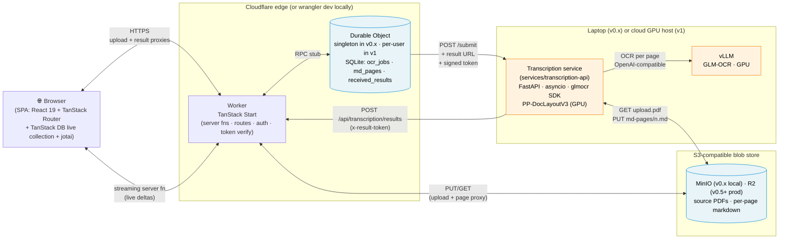

# Totvibe-OCR — Plan

> **Status:** v0.1 implementation-ready — readiness 100%
> **Last updated:** 2026-05-09
> **Walking skeleton (v0.1):** A Cloudflare-native architecture that runs locally for development and end-to-end tests via a single `podman compose up` that brings up four containerized services — `wrangler dev` (TS edge), the Python pipeline, MinIO, and vLLM — then deploys to Cloudflare in v0.5. The TS edge layer (TanStack Start as a Worker + a single shared Durable Object) owns all state in DO-embedded SQLite and pushes per-page updates to the SPA over a hibernation-aware WebSocket. The SPA holds a TanStack DB collection bound to that WebSocket and renders pages as they complete via `useLiveQuery`. The Python pipeline service (`pipeline.py`, FastAPI on asyncio) accepts job submissions from the DO over a signed-token HTTP webhook, runs the `glmocr` SDK page-by-page (PP-DocLayoutV3 on GPU + vLLM in podman), and POSTs each completion back to a public Worker callback that routes into the DO. PDFs and per-page markdown live in S3-compatible storage: **MinIO in podman locally** (mocking R2 for both the Worker and the Python pipeline via the same SDK shape), real **R2 via its S3-compatible API in production** — switched by env var. No Postgres, no pgmq. Production-ready (v1) requires multi-user (DO-per-user) + auth + pipeline on a cloud GPU host.

## 1. Vision
A small web service that turns scanned PDFs into clean markdown using GLM-OCR. Upload-in, markdown-out, page-by-page, with live updates streamed over a single WebSocket. The TS edge layer + a single Durable Object is the source of truth for job state and the only thing browsers talk to; a Python pipeline service handles the OCR work and reports back via signed-token webhooks. v0.1 is single-user, runs locally via a single `podman compose up` (wrangler dev + the Python pipeline + MinIO + vLLM, all containerized); v0.5 deploys the edge to Cloudflare; **v1 is production-ready: multi-user, properly authenticated, pipeline on a cloud GPU host.** The architecture is shaped so that v1 falls out of v0.x by changing the DO identity derivation and adding an auth gate — the core data flow does not change.

## 2. Problem & motivation
Scanned PDFs (old books, faxed documents, photographed receipts) carry no text layer, so classic converters return nothing. Image OCR tools handle text but lose layout. GLM-OCR is a 0.9B-parameter VLM that emits markdown directly with LaTeX and table structure. Combined with PP-DocLayoutV3 for layout detection, the official `glmocr` SDK gives a complete document-parsing pipeline at a hardware cost low enough to run on a laptop GPU (12 GB).

## 3. Users & primary scenarios
- Primary user: **the author for v0.x; small trusted circle and broader use after v1 (multi-user with auth — the production-ready bar).** [DECIDED]
- Key scenarios:
  - Drop a scanned PDF, get markdown back per page as each finishes — pages stream into the UI live without polling. [DECIDED]
  - Reload the browser tab mid-job; the TanStack DB collection rehydrates from the DO over HTTP and reattaches the WebSocket. [DECIDED]
  - View markdown of completed pages while later pages are still processing. [DECIDED]
  - Return days later to a job's URL and find the original PDF + all per-page markdown still there (no TTL). [DECIDED]

## 4. Goals
- Accept a PDF, return markdown produced by GLM-OCR. [DECIDED]
- Per-page incremental display, pushed live over WebSocket. [DECIDED]
- Reload-resilient via URL-addressable jobs. [DECIDED]
- Persistence in DO SQLite (state) + S3-compatible blob store (PDFs + markdown), no TTL. [DECIDED]
- Local OCR on the user's GPU (12 GB) for v0.x; cloud GPU host for v1 (production). [DECIDED]
- v0.1: Cloudflare-native, runnable locally via a single `podman compose up` that brings up wrangler dev + the Python pipeline + MinIO + vLLM as four containerized services; no auth, no public exposure. [DECIDED]
- v0.5: edge deployed to Cloudflare, pipeline still on the laptop via Cloudflare Tunnel, basic password gate or CF Access. [DECIDED]
- v1 (production-ready): multi-user via DO-per-user (`idFromName(userId)`); proper auth; pipeline on a cloud GPU host. The code change from v0.x to v1 is small: identity derivation + an auth gate + an env var swap on the pipeline endpoint. [DECIDED]
- **Strict separation between the TS edge layer (owns state, owns clients) and the Python pipeline (owns OCR): they communicate only via signed-token HTTP webhooks + S3-compatible blob storage. The pipeline never reads or writes DO state directly; it only POSTs callbacks.** [DECIDED]
- Keep dependency surface narrow within the chosen stack. [DECIDED]

## 5. Non-goals (current scope, v0.x)
- DO-per-user sharding pre-v1 (singleton DO is enough for v0.x; per-user lands in v1, the production-ready release). [DECIDED]
- Auth / TLS pre-v1 (unauthenticated `wrangler dev` for v0.1; basic password gate or CF Access for v0.5; full auth at v1). [DECIDED]
- Polling-based UI fallback. [DECIDED — replaced by WebSocket fanout]
- Postgres in any form (DO SQLite replaces it). [DECIDED]
- pgmq (DO orchestrates submissions directly via HTTP webhook + alarm-based reconciliation). [DECIDED]
- A separate "home server" — laptop runs the pipeline locally; CF runs the edge layer. [DECIDED]
- RSC / `@vitejs/plugin-rsc` pre-v1.x (kept as a future possibility, not v0.x scope). [DECIDED]
- In-browser markdown editing. [DECIDED]
- Other input formats (images, DOCX, HTML). [DECIDED]
- Multi-language UI. [DECIDED]
- TTL / automatic cleanup of finished jobs. [DECIDED]

## 6. Constraints
- OCR engine: **GLM-OCR** via the official `glmocr[selfhosted]` SDK. [DECIDED]
- Layout detection: **PP-DocLayoutV3** on GPU (paddlepaddle-gpu), integrated by the SDK. [DECIDED]
- Inference path: **vLLM in podman** on the laptop GPU for v0.x. [DECIDED]
- Hardware (v0.x): **12 GB local GPU**. [DECIDED]
- vLLM image: `vllm/vllm-openai:v0.19.0-ubuntu2404` (or newer), MTP speculative decoding enabled. [DECIDED]
- TS edge layer: **TypeScript on Cloudflare Workers via TanStack Start** (Cloudflare adapter). Server functions today; in-place RSC migration becomes a flag-flip later. [DECIDED]
- Frontend: **Vite + React 19 + TanStack Router + TanStack DB** (`useLiveQuery`); jotai retained only for local UI state (drag-drop hover, expand/collapse, modals). No RSC pre-v1.x. [DECIDED]
- Markdown rendering: **react-markdown + `remark-gfm` + `remark-math` + `rehype-katex`**. Matches GLM-OCR's output shape (tables + LaTeX, not code-heavy). [DECIDED]
- State: **single shared Durable Object with embedded SQLite** for v0.x; **DO-per-user** for v1. Tables: `ocr_jobs`, `md_pages`, `callbacks_seen`. Schema is owned by the DO's `migrate()` (idempotent `CREATE TABLE IF NOT EXISTS` for v0→v1 of the schema; versioned migrations on first wake post-deploy after that). [DECIDED]
- DB access (TS): **raw `ctx.storage.sql.exec(...)` inside the DO** to start; switch to drizzle-orm-sqlite-core if/when the query surface justifies it. [DECIDED]
- Live updates: **TanStack DB live collection** subscribing via a TanStack Start server function that returns an AsyncIterable of deltas. The DO exposes a subscription via RPC stub returning a per-connection `ReadableStream`; the server fn forwards. **No public WebSocket route, no public hydrate route** — the SPA only ever calls server fns. Hibernation-aware WS no longer required (revisit only if v1 per-user DOs need long idle subscriptions). [DECIDED]
- Reactive client store: **TanStack DB live collection** with a custom sync adapter wrapping the streaming server function above. Hydrate, delta application, and reconnect owned by the framework — no manual snapshot/delta plumbing in the SPA. Optimistic mutation via `onInsert` / `onUpdate`. [DECIDED]
- Blobs: **S3-compatible storage** for both source PDFs and per-page markdown. **Local: MinIO in podman** (mocks R2; both the Worker and the Python pipeline talk to it via S3 SDKs against the same endpoint). **Production: real R2 via its S3-compatible API.** Switch by env var (endpoint, access key, secret). [DECIDED]
- Transcription service (`services/transcription-api`, renamed 2026-05-09 from `pipeline-api`; mechanical rename pending in board item 004 §5): **lightweight HTTP server (FastAPI on uvicorn), pure `asyncio`**, calls the `glmocr` SDK + paddlepaddle-gpu. Accepts submission webhook, POSTs per-page result deliveries back to the public Worker. (Reverses the round-6 "no HTTP server in Python" decision — the service needs an inbound port.) [DECIDED]
- Signed result tokens: **HMAC-SHA256 over compact base64url JSON** with claims `{userId, ocrJobId, pageNumber?, resultId, exp}`. Secret via `wrangler secret put`. Rotation: accept two secrets during a grace window, sign with the new one. [DECIDED]
- Idempotency: every result delivery carries a unique `resultId`. Dedupe is enforced by row-level CAS on the `md_pages` / `ocr_jobs` terminal-state predicate (`WHERE completed_at IS NULL AND error IS NULL`); a side table `received_results(result_id pk, received_at)` records every delivery (including replays) for audit/debug, without gating the write. Both writes happen in the same DO SQLite transaction. [DECIDED]
- Crash recovery: **alarm-driven reconciliation**. The DO sets an alarm on submission with a **configurable timeout** (env var; default ~1 h in prod, seconds in tests); the alarm marks the row `failed('timeout')` if the callback never arrives. **Smarter status-poll reconcile** (alarm queries the pipeline's `GET /ocr-jobs/<pipeline_id>` before failing) lands in v0.5. [DECIDED]
- DO ↔ Transcription service communication: **only signed-token HTTP webhooks** (DO → service for submission, service → public Worker → DO for per-page result deliveries). No shared queue, no shared DB. The blob store is shared (DO writes the source PDF location into the row; the service reads the source PDF + writes per-page markdown to the same bucket). [DECIDED]
- Identity: v0.x uses a **singleton DO** (`USER_DO.idFromName('default')`); v1 switches to `USER_DO.idFromName(userId)`. Code change is one line. [DECIDED]
- Networking: local dev via `wrangler dev` (no TLS, no auth) for v0.1; v0.5 deploys the TS edge layer to CF (basic password gate or CF Access at the public surface). Python pipeline stays on the laptop and is reachable from the deployed Worker via Cloudflare Tunnel through v0.5. [DECIDED]
- PDF profile: **mostly scanned**. [DECIDED]
- Privacy posture: OCR computation runs only on the user's GPU pre-v1; PDFs and markdown live at rest in the blob store (MinIO locally, R2 in production). [DECIDED]
- Testing (v0.1): **vitest + React Testing Library + jsdom** for SPA-level tests; **podman-up of MinIO + a mock pipeline** for the data layer; `wrangler dev` on the host as the runtime under test. Goal is a thin e2e framework skeleton with a few example tests, **not exhaustive coverage**. The mock pipeline (`pipeline_mock.py`, or `pipeline.py --mock`) implements the same `/submit` HTTP surface as the real pipeline but POSTs canned per-page callbacks after a configurable delay — lets the test loop run without a GPU. No Playwright in v0.1. [DECIDED]

## 7. Functional requirements
1. Browser uploads PDF to a Worker route via the page (drag-drop or file picker). [DECIDED]
2. Worker validates content-type (`application/pdf`) and size (≤ 50 MB), streams the PDF to the blob store, then calls `DO.createOcrJob({uploadKey, sizeBytes, totalPages})` via stub. The DO writes the `ocr_jobs` row and per-md_page placeholders, fans out `{op: 'insert', row}` to all open subscriber streams, and fires `submitToPipeline(ocrJobId)` under `ctx.waitUntil`. [DECIDED]
3. The DO POSTs to the pipeline's submission URL with `{ocr_job_id, upload_key, callback_url, callback_token}`; the pipeline returns `{pipeline_id}` synchronously; the DO updates the row to `processing`, stores `pipeline_id`, and broadcasts. [DECIDED]
4. The transcription service downloads the PDF from the blob store, runs the SDK page-by-page, and after each page POSTs to the public Worker route `/api/transcription/results` with `{result_id, ocr_job_id, page_number, status, markdown_key?, error?}` and the result token in `x-result-token`. The Worker verifies the token, routes into the DO via stub, the DO updates `md_pages`, fans out the delta to subscriber streams, and ack's. [DECIDED]
5. The transcription service POSTs a final ocr-job-level result when all pages are processed; the DO marks `ocr_jobs.status='done'` (or `'failed'` if any page failed) and fans out. [DECIDED]
6. Per-md_page error tolerance: a single failing page sets `md_pages.status='failed'` with an error message; the ocr job continues. The UI displays the error **inline next to the failing page** (no toast, no banner). v0.x ships **without a per-md_page retry button** — re-uploading the PDF is the supported recovery path; per-md_page retry is a post-v1 feature. [DECIDED]
7. Crash recovery: the DO sets an alarm one hour after submission. If no terminal callback has arrived by alarm time, the DO marks `pending` / `processing` rows as `failed('timeout')` and broadcasts. (Pipeline-side crash mid-job leaves the job in `processing` until the alarm fires; a smarter reconcile that polls the pipeline for status is a v0.5 enhancement — see §13.) [DECIDED]
8. Worker code deploy mid-flight drops all open subscriber streams; clients reconnect via the TanStack DB live collection's sync adapter, which re-invokes the streaming server fn and re-hydrates. In-flight pipeline submissions whose `pipeline_id` was already stored survive the deploy; ones that hadn't yet stored their `pipeline_id` are caught by the alarm. [DECIDED]
9. OcrJob-as-URL: each upload becomes a stable URL (`/ocr-jobs/<id>`). [DECIDED]
10. **Live updates only — no polling fallback.** TanStack DB live collection's sync adapter handles reconnect; on resync after >T seconds disconnected (configurable, default 5 s) the adapter re-hydrates the full collection. [DECIDED]
11. Original PDF retrievable from the ocr job's URL after completion via a Worker route that proxies the blob-store GET. [DECIDED]
12. Caps: **50 MB max file size**, **100 pages max**, **10 queued/in-flight ocr jobs max** (the DO checks the count of `pending`+`processing` rows on submission), **1 in-flight page per ocr job** (pipeline-side). Enforced both in Worker validation and as DO SQLite `CHECK` constraints. [DECIDED]
13. OcrJob ID format: **ULID**. [DECIDED]

## 8. Walking skeleton (v0.1 / MVP)
- **Four runnable pieces. No Postgres, no pgmq:**
  1. **TS edge layer** — TanStack Start app deployed as a Worker, with a single Durable Object class. Local dev via `wrangler dev` running **inside a podman container** (DO + Worker runtime emulated by miniflare under the hood; container port `8787` published to `localhost:8787`). The DO is addressed by `USER_DO.idFromName('default')`.
  2. **MinIO** (podman) on `localhost:9000` (console on `:9001`) — S3-compatible blob store; used by both the Worker and the Python pipeline via standard S3 SDKs. Bucket created at first run via an init job.
  3. **Transcription service** (`services/transcription-api`, renamed 2026-05-09 from `pipeline-api`) — FastAPI app **running inside a podman container**, port `8000` published to `localhost:8000`. Endpoints: `POST /submit` (accept an ocr job, queue an asyncio task, return `{pipeline_id}`), `GET /ocr-jobs/<pipeline_id>` (status; used by the DO's alarm reconcile in v0.5+), `GET /healthz`. Uses `aioboto3` (or `aiobotocore`) for S3-compatible storage access, the `glmocr` SDK + paddlepaddle-gpu for OCR, `aiosqlite` for service-local crash-recovery state. POSTs result deliveries to `${PUBLIC_BASE}/api/transcription/results`.
  4. **vLLM** (podman, GPU passthrough) on `localhost:8080`, serving GLM-OCR with MTP speculative decoding.
- DO SQLite tables (created idempotently by the DO's `migrate()` on first wake):
  - `ocr_jobs(id text pk, status text check (status in ('pending','processing','done','failed')), upload_key text not null, size_bytes int check (size_bytes <= 52428800), total_pages int check (total_pages <= 100), pipeline_id text, error text, created_at int, started_at int, completed_at int)`
  - `md_pages(ocr_job_id text references ocr_jobs, page_number int, status text check (status in ('pending','done','failed')), markdown_key text, error text, primary key (ocr_job_id, page_number))`
  - `received_results(result_id text pk, received_at int)` — audit log of every delivery received (including replays). Does NOT gate writes; dedupe is enforced by row-level CAS on the `md_pages` / `ocr_jobs` terminal-state predicate (`WHERE completed_at IS NULL AND error IS NULL`).
- Blob layout (MinIO locally, R2 in production — same keys):
  - `ocr-jobs/<id>/upload.pdf`
  - `ocr-jobs/<id>/md-pages/<n>.md`
- Worker entry points (sketch, no code):
  - **Server functions** (TanStack Start; called only from the SPA):
    - `streamOcrJobs()` — returns an AsyncIterable of `(snapshot | delta)` events; the SPA's TanStack DB live collection consumes it. Internally opens a subscription against the DO via RPC stub and forwards.
    - `streamMdPages(ocrJobId)` — same shape, scoped to one ocr job's pages.
    - `createOcrJob({ uploadKey, sizeBytes, totalPages })` — called from the SPA's optimistic `onInsert`; fans out to the DO via stub and returns the persisted row.
  - **Public routes** (HMAC-signed or just-PDF-bytes):
    - `POST /api/ocr-jobs` — validates upload, streams PDF to the blob store via S3 SDK, calls `DO.createOcrJob` via stub. Returns `{ocrJobId}`. (May fold into the `createOcrJob` server fn at implementation time.)
    - `POST /api/transcription/results` — token-authenticated (`x-result-token`); verifies HMAC signature, routes into the DO via stub. DO writes to the `received_results` audit table, then performs a row-level CAS on the terminal-state predicate to apply the update.
    - `GET /api/ocr-jobs/<id>/upload` — proxies the blob-store GET for the original PDF.
    - `GET /api/ocr-jobs/<id>/md-pages/<n>` — proxies the blob-store GET for a per-md_page markdown (the SPA can also render markdown directly off the live `markdown_key`-bearing row by fetching once on demand and caching client-side).
- Transcription service loop (per ocr job):
  1. Receive `POST /submit` with `{ocr_job_id, upload_key, result_url, result_token}`. Persist to local SQLite (so the service can recover its own crashes), return `{pipeline_id}` immediately.
  2. Download PDF from the blob store to a tmp dir.
  3. Run the SDK page-by-page. After each page: write markdown to the blob store, POST result delivery `{result_id, ocr_job_id, page_number, status: 'done'|'failed', markdown_key?, error?}` with `x-result-token`. Retry on transient delivery failures with exponential backoff and a per-md_page deadline.
  4. POST ocr-job-level final result `{status: 'done'|'failed'}`. Clean up tmp.
- Single concurrent ocr job at a time backend-wide (one transcription service instance, one in-flight page per ocr job). Multiple queued ocr jobs are serialized by the service's submission queue.
- For tests and fast iteration without GPU, `transcription_mock.py` (or `transcription.py --mock`) implements the same HTTP surface as the real service but returns canned per-page result deliveries after a configurable delay. v0.1's e2e tests use this; the real service + vLLM only run in dev sessions where the OCR output matters.

## 9. Architecture sketch

*How do the pieces cooperate to turn a PDF upload into per-page markdown streamed to the SPA?*

The two halves never share state directly. The Worker + DO owns all client-facing state; the transcription service owns OCR. They meet at signed-token HTTP webhooks and the S3-compatible blob store — every state transition that changes the UI happens in the DO, and the DO is the only thing that fans out to subscriber streams. Each side has its own SQLite: the DO owns `ocr_jobs` / `md_pages` / `received_results` (client-facing state + delivery audit log); the transcription service owns `pipeline_ocr_jobs` (its own crash-recovery view of accepted submissions).

- **TS edge layer (TanStack Start as Worker + DO)**:
  - SPA: TanStack Router for `/` and `/ocr-jobs/<id>`; TanStack DB collection for live ocr_job/md_page data; `useLiveQuery` in components.
  - Worker routes: upload, hydrate, WebSocket entrypoint, callback receiver, blob-store proxies.
  - DO: singleton in v0.x, per-user in v1; owns SQLite + per-subscriber stream fanout (no public WS); signs result tokens; sets alarms for reconciliation.
  - No knowledge of glmocr, paddlepaddle, vLLM, or the OCR internals.
- **Transcription service** (`services/transcription-api`):
  - `transcription.py` — FastAPI on uvicorn. Submission endpoint accepts `{ocr_job_id, upload_key, result_url, result_token}`, queues an asyncio task, returns `{pipeline_id}` synchronously.
  - Per-ocr-job task downloads the PDF from the blob store, runs the SDK page-by-page, POSTs per-md_page and final result deliveries. No knowledge of TanStack / DO / Workers.
  - Local SQLite (file via `aiosqlite`) tracks service-side ocr_job state for crash recovery.
- **vLLM container** (podman, GPU passthrough): `vllm/vllm-openai:v0.19.0-ubuntu2404` serving `zai-org/GLM-OCR` on `localhost:8080`, called only by the pipeline.
- **Blob store**: MinIO container in podman locally; real R2 in production. Same code path, env-var swap of endpoint + credentials.
- **Local dev orchestration**: a single root `justfile` delegates everything to `podman compose -f infra/compose.yaml -f infra/compose.dev.yaml up`. Four containerized services (wrangler dev, the transcription service, MinIO, vLLM), one entry point. Variants (mock service without GPU, future test stack) are sibling override files. See [`project-structure.md`](./done/001-proj-struct.md) for the repo layout.

## 10. Tech stack
- OCR model: **GLM-OCR**. [DECIDED]
- OCR serving: **vLLM**, image `vllm/vllm-openai:v0.19.0-ubuntu2404`. [DECIDED]
- Document pipeline: **`glmocr[selfhosted]` SDK** with PP-DocLayoutV3 on GPU (paddlepaddle-gpu). [DECIDED]
- Container runtime: **podman** (MinIO + vLLM in v0.x; possibly the Python pipeline). [DECIDED]
- Edge runtime: **Cloudflare Workers + Durable Objects with embedded SQLite** (10 GB cap per DO). [DECIDED]
- Local edge dev: **`wrangler dev`** (miniflare under the hood for local DO + Worker runtime emulation). Blob storage is the separate MinIO container, **not** miniflare's R2 emulation — the Python pipeline needs an external S3 endpoint, and using MinIO keeps the Worker and pipeline on the same SDK shape. [DECIDED]
- Blobs (local): **MinIO** in podman (S3-compatible). [DECIDED]
- Blobs (cloud): **Cloudflare R2** via its S3-compatible API. Same SDK calls; env-var swap of endpoint + credentials. [DECIDED]
- State: **DO-embedded SQLite**. Schema bootstrapped by the DO's `migrate()`. [DECIDED]
- DB access (TS): **raw `ctx.storage.sql.exec(...)`**; switch to **drizzle-orm-sqlite-core** if/when the query surface justifies it. [DECIDED]
- Live updates: **TanStack DB live collection** over a streaming server function. The DO exposes a per-connection `ReadableStream` subscription via RPC stub; **no public WebSocket route**. Hibernation-aware WS no longer required. [DECIDED]
- Reactive client store: **TanStack DB** live collection with a custom sync adapter wrapping the streaming server function. Hydrate, delta application, and reconnect owned by the framework. [DECIDED]
- Frontend framework: **React 19** (no RSC pre-v1.x) + **TanStack Router**. [DECIDED]
- TS framework / server backend: **TanStack Start** (Cloudflare adapter). [DECIDED]
- Frontend build: **Vite**. [DECIDED]
- Frontend state (UI-only): **jotai** — less central than the polling-era plan; mostly drag-drop / modal state. [DECIDED]
- Markdown rendering: **react-markdown + remark-gfm + remark-math + rehype-katex**. [DECIDED]
- Test framework (v0.1): **vitest + React Testing Library + jsdom** for the SPA; podman-up of MinIO + mock pipeline for the data layer; `wrangler dev` on the host. No Playwright. [DECIDED]
- S3 client (TS): **`@aws-sdk/client-s3`** against MinIO locally and R2 in production (env-var swap). [DECIDED]
- S3 client (Python): **`aioboto3`** (or `aiobotocore`) against the same endpoint. [DECIDED]
- Python framework: **FastAPI on uvicorn**. [DECIDED]
- Python package manager: **uv**. [DECIDED]
- Pipeline-local persistence: **`aiosqlite`** for pipeline-side crash recovery. [DECIDED]
- Local dev orchestration: **`justfile`** recipes that delegate to `podman compose`. `just dev` = `podman compose -f infra/compose.yaml -f infra/compose.dev.yaml up` (all four services in containers); `just dev-mock` = same with `compose.mock.yaml` override (mock pipeline, no GPU); `just up` / `just down` for stack control; `just build` for image rebuilds. See [`project-structure.md`](./done/001-proj-struct.md) for the full layout. [DECIDED]

## 11. Roadmap
- **v0.1 / walking skeleton (local-only)**: full Cloudflare-native architecture runnable locally via a single `podman compose up` — wrangler dev, the Python pipeline, MinIO, and vLLM all run as containers in one compose stack. Singleton DO. No auth. **No Cloudflare deployment.** E2E test framework skeleton (vitest + React Testing Library) drives the local stack with a mock pipeline (compose override variant) so the test loop has no GPU dependency. [DECIDED]
- **v0.5 — first Cloudflare deploy**: deploy the Worker + DO to CF; Python pipeline stays on the laptop, exposed to the deployed Worker via Cloudflare Tunnel; basic password gate or CF Access at the public surface. Blob store swaps from MinIO to real R2 by env var. Still single-user (singleton DO). **Improvements that ride along**: smart alarm reconcile (poll the pipeline's status endpoint before failing instead of just timing out).
- **v1 — production-ready**: multi-user via DO-per-user (`idFromName(userId)`), proper auth (CF Access or magic-link / OAuth allow-list), Python pipeline on a cloud GPU host (CF Containers with GPU, Modal, RunPod, etc.). DO + R2 unchanged. **This is the first publicly shippable release.**
- **v1.x — RSC + server functions** for the TS edge layer (drop ad-hoc API endpoints in favor of server functions; the producer/consumer separation is unchanged).
- **v2+**: more input formats, batch upload, side-by-side preview, parallel page processing within a job, delta-resumption protocol on WebSocket reconnect (`?since=<seq>`), schema-migration framework for evolving DO SQLite across deployed users, per-page retry button.

## 12. Decisions log

The full chronological decisions log (rounds 1–12) has been moved to [`totvibe-ocr-decision-log.md`](./totvibe-ocr-decision-log.md).

> **Heads up:** that file contains a lot of outdated and superseded ideas. **Do not use it as a guide for current architecture or implementation.** It exists for history only — to understand *why* this plan looks the way it does and what was considered along the way. The authoritative current state is the rest of this document.

## 13. Open questions
*None blocking v0.1 implementation. The remaining decisions all naturally fall out at coding time (exact justfile recipe shapes, mock pipeline canned-response format, vitest configuration). v0.5+ items tracked as known unknowns in §14.*

## 14. Known unknowns
- Real-world quality of GLM-OCR + PP-DocLayoutV3 on the user's actual scans.
- Real-world VRAM and latency under MTP speculative decoding plus PP-DocLayoutV3 sharing the card.
- Sharp edges of TanStack Start's Cloudflare adapter as of May 2026 (especially around DO RPC stubs from server functions and any RSC-mode preview work).
- Sharp edges of TanStack DB 0.6+ as the reactive client store — custom sync-adapter API is on a moving 0.x; risk knowingly accepted (pre-v0.1, zero deployment, rewrite is cheap if API shape changes). Optimistic-mutation reconciliation when the DO's stream push races the local optimistic insert is also TBD.
- Real-world impact of Worker code deploys on in-flight OCR jobs — needs a deploy-during-job test before going to v1 (production).
- Wrangler dev's reliability under the v0.1 workload (DO + WebSocket + alarm all locally emulated). Historically miniflare is close to but not exactly equal to production behaviour around hibernation and alarms.
- Schema-migration ergonomics across DOs that have been cold for months — relevant once v1 introduces DO-per-user.
- Future GPU hosting target for v1 (CF Containers with GPU, Modal, RunPod) — pricing and DX vary substantially.
- Whether DO SQLite's 10 GB cap holds up; almost certainly fine because PDFs and markdown live in the blob store and only metadata sits in the DO.
