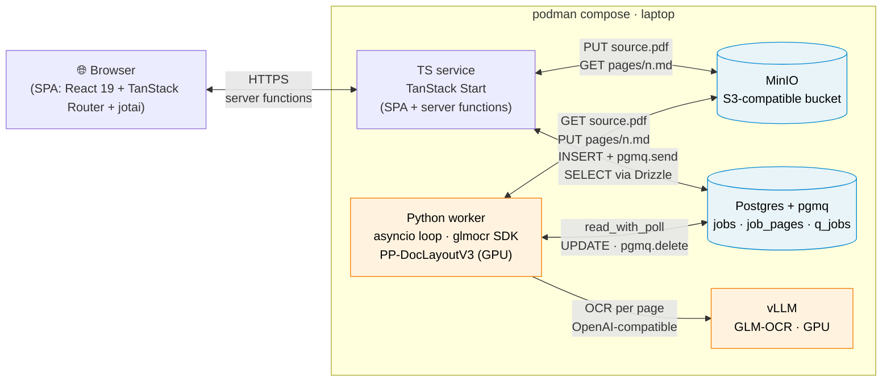

# Totvibe-OCR — Plan

> **Status:** ready to implement — readiness 100%
> **Last updated:** 2026-04-27
> **Walking skeleton:** A laptop-only setup with two independent services that share data through Postgres (with the **pgmq** extension) + S3. A TypeScript service (TanStack Start: Vite + React 19 + TanStack Router + jotai, plus server functions) hosts the SPA and a thin server backend that receives PDF uploads, streams them to MinIO (S3-compatible), and atomically inserts a `jobs` row + sends a message to the `q_jobs` pgmq queue. A Python `worker.py` (`asyncio` + `psycopg` + `aioboto3` + `glmocr` SDK) calls `pgmq.read_with_poll('q_jobs', ...)` to long-poll for work, runs the SDK page-by-page (PP-DocLayoutV3 on GPU + vLLM in podman), and writes per-page markdown to MinIO + per-page status to Postgres, then deletes the queue message on success. The two services never call each other; they meet at Postgres + S3.

## 1. Vision
A small web service that turns scanned PDFs into clean markdown using GLM-OCR. Upload-in, markdown-out, page-by-page. v1 runs entirely on the user's laptop using podman containers (MinIO, Postgres, vLLM) plus two local processes (TS service and Python service). Architecture is shaped for "deploy to Cloudflare" later — MinIO → R2, local Postgres → managed Postgres, Python service → cloud GPU host — without rewriting the core logic.

## 2. Problem & motivation
Scanned PDFs (old books, faxed documents, photographed receipts) carry no text layer, so classic converters return nothing. Image OCR tools handle text but lose layout. GLM-OCR is a 0.9B-parameter VLM that emits markdown directly with LaTeX and table structure. Combined with PP-DocLayoutV3 for layout detection, the official `glmocr` SDK gives a complete document-parsing pipeline at a hardware cost low enough to run on a laptop GPU (12 GB).

## 3. Users & primary scenarios
- Primary user: **just the author for v1; small trusted circle later** (when cloud deploy lands). [DECIDED]
- Key scenarios:
  - Drop a scanned PDF, get markdown back per page as each finishes, view/copy/download. [DECIDED]
  - Reload the browser tab mid-job and resume the same view. [DECIDED]
  - View markdown of completed pages while later pages are still processing. [DECIDED]
  - Return days later to a job's URL and find the original PDF + all per-page markdown still there (no TTL). [DECIDED]

## 4. Goals
- Accept a PDF, return markdown produced by GLM-OCR. [DECIDED]
- Per-page incremental display. [DECIDED]
- Reload-resilient via URL-addressable jobs. [DECIDED]
- Persistence in S3 + Postgres (no TTL). [DECIDED]
- Run on the user's laptop GPU (12 GB). [DECIDED]
- v1: local-only, no public exposure, no auth. [DECIDED]
- Architecture must let cloud deployment be added later without significant rewrites. [DECIDED]
- **Strict separation between the TS service and the Python service: they must not import or call each other; they communicate only via Postgres + S3.** [DECIDED]
- Keep dependency surface narrow within the chosen stack. [DECIDED]

## 5. Non-goals (current scope)
- Public access / auth / TLS / reverse proxy in v1. [DECIDED]
- Cloud deployment of frontend or backend in v1. [DECIDED]
- A separate "home server" — laptop runs everything. [DECIDED]
- RSC / `@vitejs/plugin-rsc` in v1 (kept as a future possibility, not v1 scope). [DECIDED]
- Direct API calls between the TS service and the Python service. [DECIDED]
- In-browser markdown editing. [DECIDED]
- Other input formats (images, DOCX, HTML). [DECIDED]
- Multi-language UI. [DECIDED]
- TTL / automatic cleanup of finished jobs. [DECIDED]

## 6. Constraints
- OCR engine: **GLM-OCR** via the official `glmocr[selfhosted]` SDK. [DECIDED]
- Layout detection: **PP-DocLayoutV3**, integrated by the SDK, on **GPU** (paddlepaddle-gpu). [DECIDED]
- Inference path: **vLLM in podman** on the laptop GPU. [DECIDED]
- Hardware: **12 GB local GPU**. [DECIDED]
- vLLM image: `vllm/vllm-openai:v0.19.0-ubuntu2404` (or newer), MTP speculative decoding enabled. [DECIDED]
- TS service language: **TypeScript**. [DECIDED]
- TS service backend framework: **TanStack Start** (server functions today; SSR; RSC migration becomes a flag-flip later). [DECIDED]
- Frontend: **Vite + React 19** (no RSC in v1) + **TanStack Router** + **jotai**. [DECIDED]
- Markdown rendering: [PROPOSED] **react-markdown + `remark-gfm` + `remark-math` + `rehype-katex`**.
- Python service framework: **pure `asyncio` script** (`worker.py` with `psycopg` + `aioboto3` + `glmocr` SDK). No HTTP server. [DECIDED]
- Storage: **S3-compatible**. **Local: MinIO in podman.** **Future: Cloudflare R2.** Switch via env vars. [DECIDED]
- State: **Postgres** (`jobs`, `job_pages` tables managed by Drizzle on the TS side; Python reads/writes via `psycopg` raw SQL). [DECIDED]
- Queue: **pgmq Postgres extension** with `pgmq.send` (TS service) and `pgmq.read_with_poll` (Python worker). Local image: **`tembo/pg17-pgmq`**. Visibility timeout (`vt`) default = 600 s; worker poll window default = 30 s. Future: same extension on managed Postgres (Tembo Cloud, or self-installed on Neon/Supabase). [DECIDED]
- DB schema bootstrap: **`init.sql`** mounted into the Postgres container creates the `pgmq` extension and the `q_jobs` queue. **Drizzle migrations** own the `jobs` and `job_pages` tables. Drizzle is TS-only — Python uses `psycopg` raw SQL against the schema Drizzle writes. [DECIDED]
- Communication between services: **only via Postgres + S3, no direct calls.** [DECIDED]
- Networking: everything on the laptop in v1. No reverse proxy, no TLS, no auth. [DECIDED]
- PDF profile: **mostly scanned**. [DECIDED]
- Privacy posture: OCR computation runs only on the local GPU; PDFs and markdown live at rest in S3 (MinIO locally, R2 in cloud). [DECIDED]

## 7. Functional requirements
1. Browser uploads PDF to the TS service via the page (drag-drop or file picker). [DECIDED]
2. TS service validates content-type (`application/pdf`) and size (≤ 50 MB), streams the PDF to S3, and **atomically** inserts a `jobs` row + `pgmq.send('q_jobs', {job_id})` in one transaction. [DECIDED]
3. Python worker calls `pgmq.read_with_poll('q_jobs', vt := 600, qty := 1, max_poll_seconds := 30)`; on receiving a message, marks `jobs.status='processing'`, then runs the `glmocr` SDK page-by-page. [DECIDED]
4. After each page completes, Python worker writes `jobs/<id>/pages/<n>.md` to S3 and updates the `job_pages` row to `status='done'`. [DECIDED]
5. Python worker marks the `jobs` row `done` (or `failed`) when all pages are processed, then deletes the queue message via `pgmq.delete`. [DECIDED]
6. Per-page error tolerance: a single failing page sets `job_pages.status='failed'` with an error message; the job continues. The UI displays the error **inline next to the failing page** (no toast, no banner, no global alert). v1 ships **without a per-page retry button** — re-uploading the PDF is the supported recovery path; per-page retry is a v2 feature. [DECIDED]
7. Worker crash recovery: if the worker dies mid-job, the queue message reappears after `vt` (10 min); the worker re-claims and idempotently resumes (skip pages already `done`). [DECIDED]
8. TS service reads `jobs` + `job_pages` from Postgres (Drizzle queries) and per-page markdown from S3 (TS server proxies S3 reads at `GET /api/jobs/<id>/pages/<n>`). Per-page markdown is **cached in-process by an LRU keyed on `(job_id, page_number)`** — markdown is immutable once written, so re-reads (expand/collapse, retries) hit the cache. [DECIDED]
9. Job-as-URL: each upload becomes a stable URL (`/jobs/<id>`). [DECIDED]
10. Frontend polls TS service every **1.5 s** while a job is in flight; **stops polling** once the job is `done` or `failed` (terminal states). [DECIDED]
11. Original PDF retrievable from the job's URL after completion. [DECIDED]
12. Sane upload caps: **50 MB max file size**, **100 pages max**, **10 queued jobs max**, **1 in-flight page per job**. Enforced in TS server validation **and** as Postgres `CHECK` constraints. [DECIDED]
13. Job ID format: **ULID**. [DECIDED]

## 8. Walking skeleton (v1 / MVP)
- Five services in a single `compose.yaml`:
  1. **TS service** (TanStack Start, Node or Bun): SPA + server functions for upload + reads. Default port `localhost:3000`.
  2. **Python worker** (`worker.py`): `asyncio` loop calling `pgmq.read_with_poll`, driving the `glmocr` SDK. No HTTP server.
  3. **MinIO** (S3-compatible storage) on `localhost:9000` (console on `:9001`).
  4. **Postgres + pgmq** (`tembo/pg17-pgmq`) on `localhost:5432`.
  5. **vLLM** (GPU passthrough) serving GLM-OCR on `localhost:8080` with MTP speculative decoding.
- Bootstrap (`init.sql` mounted into Postgres): `CREATE EXTENSION IF NOT EXISTS pgmq; SELECT pgmq.create('q_jobs');`
- Drizzle migrations create the application tables:
  - `jobs(id text pk default ulid, status text, source_key text, size_bytes int CHECK (size_bytes <= 52428800), total_pages int, created_at, started_at, completed_at, error)`.
  - `job_pages(job_id text references jobs, page_number int, status text, markdown_key text, error, primary key (job_id, page_number))`.
- S3 layout:
  - `jobs/<id>/source.pdf`
  - `jobs/<id>/pages/<n>.md`
- TS server functions (sketch):
  - `createJob(formData)` — validates, streams PDF to S3, runs `BEGIN; INSERT INTO jobs(...); SELECT pgmq.send('q_jobs', json_build_object('job_id', $1)); COMMIT;`, returns `{job_id}`.
  - `getJob(id)` — returns `{status, total_pages, pages: [{n, status}]}` from Drizzle queries.
  - `getPageMarkdown(id, n)` — reads `jobs/<id>/pages/<n>.md` from S3 and returns the text.
  - `getOriginalPdf(id)` — proxies the source PDF stream from S3 (with appropriate content-type).
- Python worker loop:
  1. `pgmq.read_with_poll('q_jobs', vt := 600, qty := 1, max_poll_seconds := 30)` — long-poll for a job.
  2. Mark `jobs.status='processing'`, `started_at = now()`.
  3. Pull PDF from S3 to a tmp dir.
  4. Run the SDK page-by-page. For each page: write markdown to S3, update `job_pages`. (On crash: visibility timeout reissues the message; resumed worker skips pages already `done`.)
  5. Mark `jobs.status='done'` (or `failed`); `pgmq.delete('q_jobs', msg_id)`; clean up tmp.
- Single concurrent job at a time backend-wide (one Python worker, one in-flight page per job).

## 9. Architecture sketch

*How do the five services cooperate to turn a PDF upload into per-page markdown?*

The two halves never call each other. The TS service writes into Postgres + S3; the Python worker reads from Postgres (via `pgmq.read_with_poll`) + S3, runs the OCR, and writes results back the same way. Postgres + S3 is the entire contract surface.

- **TS service (TanStack Start)**:
  - SPA: TanStack Router for `/` and `/jobs/<id>`; jotai atoms for client state (current job, polling timer, expand state); react-markdown for rendering pages.
  - Server functions (replacing what would otherwise be REST endpoints): `createJob`, `getJob`, `getPageMarkdown`, `getOriginalPdf`.
  - Drizzle for DB schema + migrations + queries.
  - `@aws-sdk/client-s3` for MinIO/R2.
  - No knowledge of Python, vLLM, paddlepaddle, glmocr SDK, or GLM-OCR.
  - Future cloud variant: same code deployed via TanStack Start's Cloudflare adapter (Workers); env vars switch MinIO → R2 endpoint.
- **Python worker**:
  - `worker.py` — pure `asyncio` script using `psycopg` (async, raw SQL), `aioboto3`, and the `glmocr` SDK + `paddlepaddle-gpu`.
  - Talks to Postgres (pgmq + jobs/job_pages), MinIO (read PDF, write markdown), and vLLM (via the SDK's `OCRClient` config).
  - No HTTP server. No knowledge of TanStack / Vite / React / Drizzle.
  - Future cloud variant: same script on a GPU host (CF Containers, Modal, RunPod); env vars switch endpoints.
- **vLLM container (podman, GPU passthrough)**:
  - `vllm/vllm-openai:v0.19.0-ubuntu2404` serving `zai-org/GLM-OCR` on `localhost:8080`.
  - Called only by the Python worker via the `glmocr` SDK's `OCRClient` configuration (`pipeline.ocr_api.api_host = vllm`, `api_port = 8080` in `config.yaml` when running inside compose).
- **MinIO container**:
  - S3-compatible storage. Bucket created at first run via an init job in compose.
  - Both services use it via S3 SDKs (`@aws-sdk/client-s3` in TS, `aioboto3` in Python). Endpoint + keys come from env vars; flip to R2 by changing env vars only.
- **Postgres + pgmq container** (`tembo/pg17-pgmq`):
  - Single DB. pgmq extension installed via `init.sql`. `jobs` + `job_pages` tables managed by Drizzle.
  - Queue: `q_jobs` (single message shape `{job_id: text}`).
- **Local dev orchestration**: a single `compose.yaml` brings up all five services. `justfile` is the operator entry point. Default flow: `just up` (everything in compose). Escape-hatch flow: `just up-stateful` + `just dev-ts` + `just dev-worker` (stateful services in compose, app code on the host). Debug mode: `just up-debug` (full compose, with Node `--inspect` and `debugpy` ports exposed).

## 10. Tech stack
- OCR model: **GLM-OCR**. [DECIDED]
- OCR serving: **vLLM**, image `vllm/vllm-openai:v0.19.0-ubuntu2404`. [DECIDED]
- Document pipeline: **`glmocr[selfhosted]` SDK** with PP-DocLayoutV3 on GPU (paddlepaddle-gpu). [DECIDED]
- Container runtime: **podman** (vLLM + MinIO + Postgres at minimum; possibly TS/Python too). [DECIDED]
- Storage (local): **MinIO**. [DECIDED]
- Storage (cloud, future): **Cloudflare R2**. [DECIDED]
- State + queue: **Postgres** (`SELECT FOR UPDATE SKIP LOCKED`). [DECIDED]
- Postgres image (local): **`tembo/pg17-pgmq`**. [DECIDED]
- Postgres queue extension: **pgmq** (`pgmq.send`, `pgmq.read_with_poll`, `pgmq.delete`). [DECIDED]
- Postgres client + ORM (TS): **Drizzle ORM** for schema, migrations, and queries. [DECIDED]
- Postgres client (Python): **`psycopg` (v3, async)** with raw SQL (no Python ORM; schema is owned by Drizzle on the TS side). [DECIDED]
- S3 client (TS): **`@aws-sdk/client-s3`** (works with MinIO and R2; swap endpoint via env). [DECIDED]
- S3 client (Python): **`aioboto3`**. [DECIDED]
- TS framework / server backend: **TanStack Start**. [DECIDED]
- Frontend build: **Vite**. [DECIDED]
- Frontend framework: **React 19** (no RSC in v1). [DECIDED]
- Frontend state: **jotai**. [DECIDED]
- Frontend routing: **TanStack Router**. [DECIDED]
- Markdown rendering: [PROPOSED] **react-markdown + `remark-gfm` + `remark-math` + `rehype-katex`**.
- Python package manager: [PROPOSED] **uv**.
- Local dev orchestration: **single `compose.yaml`** covering all five services (MinIO, Postgres+pgmq, vLLM, TS service, Python worker). Default workflow runs everything in compose (debugging inside containers via Node `--inspect` + Python `debugpy` over forwarded ports). The **`justfile`** provides escape-hatch host-mode recipes — `just up-stateful` brings up MinIO/Postgres/vLLM only, `just dev-ts` runs the TS service on the host, `just dev-worker` runs the Python worker on the host — for the cases where a developer wants the fastest possible iteration loop without touching containers. [DECIDED]
- DB migrations / init: **`init.sql`** for the pgmq extension + queue creation; **Drizzle migrations** for `jobs` + `job_pages` tables. [DECIDED]

## 11. Roadmap
- **v1 / walking skeleton (laptop)**: TS service + Python service + MinIO + Postgres + vLLM, all on the laptop. No auth, no public exposure.
- **v1.5 — deploy frontend to Cloudflare** (Workers or Pages): build the SPA, deploy the TS server bits as Workers; backend (Python + vLLM) still on the laptop, exposed via Cloudflare Tunnel; basic auth at the tunnel.
- **v2 — backend in the cloud**: Python service on a cloud GPU host (CF Containers with GPU, Modal, RunPod, etc.); MinIO replaced by R2 (env-var swap); Postgres replaced by managed Postgres (Neon / Supabase / Hyperdrive).
- **v2.5 — proper auth** (CF Access in front of the public surface, or magic-link / OAuth + allow-list).
- **v3 — RSC + server functions** for the TS service (drop ad-hoc API endpoints in favor of server functions; the producer/consumer separation is unchanged).
- **v3+**: more input formats, batch upload, side-by-side preview, parallel page processing within a job, `LISTEN/NOTIFY` for instant triggering.

## 12. Decisions log
- 2026-04-27: GLM-OCR chosen — markdown-native output, table/formula handling, small enough to self-host.
- 2026-04-27: Audience for v1 = the author; design for "small trusted circle later".
- 2026-04-27: PDF profile = mostly scanned. No text-layer fast-path needed for v1.
- 2026-04-27: Self-host via vLLM + podman. Verified 12 GB GPU is sufficient (model is 0.9B).
- 2026-04-27: Use the official `glmocr` SDK with PP-DocLayoutV3. Verified the SDK can call a remote vLLM endpoint via `config.yaml`.
- 2026-04-27: UX = server-side state, URL-addressable jobs, polling-based per-page incremental rendering.
- 2026-04-27: PP-DocLayoutV3 placement = GPU, sharing the card with vLLM.
- 2026-04-27: RSC dropped from v1; frontend = plain Vite + React 19 + jotai.
- 2026-04-27: v1 deploys nowhere — runs entirely on the laptop.
- 2026-04-27 (this round): Two independent services. The TS service handles UI + uploads + reads; the Python service handles OCR. They share only Postgres + S3 — no direct calls. This is the central architectural decision.
- 2026-04-27 (this round): Postgres added as a v1 dependency. It plays double duty as the shared state store and the work queue (`SELECT ... FOR UPDATE SKIP LOCKED`). Reasoning: with no direct calls allowed, state has to live somewhere both services can reach; Postgres adds queryable history for free; LISTEN/NOTIFY is available later if polling latency becomes an issue.
- 2026-04-27 (this round): Upload path = browser → TS server → S3 (MinIO/R2). Earlier "browser → S3 via signed PUT URL" is reversed in light of "TS backend should handle uploads".
- 2026-04-27 (this round): Local S3 = MinIO container. Cloud S3 = R2. Switch via env vars.
- 2026-04-27 (this round): Routing = TanStack Router.
- 2026-04-27 (this round): Markdown rendering = react-markdown + remark-gfm + remark-math + rehype-katex (recommended over the full remark/rehype/shiki pipeline because GLM-OCR's output is mostly tables and LaTeX, not code).
- 2026-04-27 (round 6): TS service backend = **TanStack Start**. Gives server functions in v1 (no hand-built API surface) and an in-place RSC migration when stable.
- 2026-04-27 (round 6): Python worker = **pure `asyncio` script**. No worker framework dependency; the loop is small enough that any framework would be larger than the code it replaces. `procrastinate` is the natural upgrade if it grows.
- 2026-04-27 (round 6): Local dev = **single `compose.yaml` for everything** (MinIO, Postgres, vLLM, TS service, Python worker) plus a **`justfile`** as the operator entry point for all dev operations.
- 2026-04-27 (round 7): Queue = **pgmq** Postgres extension. `pgmq.read_with_poll` replaces the earlier hand-rolled `FOR UPDATE SKIP LOCKED` polling — strictly better (long-poll + visibility timeout for crash recovery + archive). Postgres image switches to `tembo/pg17-pgmq`.
- 2026-04-27 (round 7): Frontend read path for finished pages = **TS server proxies S3 reads**. One auth/permission boundary, one origin from the SPA's view.
- 2026-04-27 (round 7): DB management split = `init.sql` for the pgmq extension + queue creation; **Drizzle migrations** for `jobs` + `job_pages`. Drizzle is the schema source of truth; Python uses raw `psycopg` against that schema.
- 2026-04-27 (round 7): Containerization default = **all five services in compose**, with `just up-debug` exposing debug ports. Host-mode (`just up-stateful` + `just dev-*`) remains supported for fastest iteration loops.
- 2026-04-27 (round 7): Defaults bundle accepted — ULID job IDs, 50 MB / 100 pages / 10 queued / 1 in-flight page, validation in both TS server and Postgres `CHECK` constraints.
- 2026-04-27 (round 8): Final closeout. Polling cadence = 1.5 s in flight, stop on terminal state. TS server keeps an in-process LRU cache of per-page markdown (immutable once written). Error UI = inline next to the failing page, no v1 retry button (re-upload is the recovery path; per-page retry is v2). LISTEN/NOTIFY-style push UI deferred to v2 (orthogonal to pgmq).

## 13. Open questions
*None. All structural and detail questions are resolved; the plan is implementation-ready.*

## 14. Known unknowns
- Real-world quality of GLM-OCR + PP-DocLayoutV3 on the user's actual scans.
- Real-world VRAM and latency under MTP speculative decoding plus PP-DocLayoutV3 sharing the card.
- Sharp edges of TanStack Start as of April 2026 (especially around server functions in production builds and any RSC-mode preview work).
- Future GPU hosting target for cloud deploy (CF Containers with GPU, Modal, RunPod, etc.) — pricing and DX vary substantially.
- Whether Postgres-as-queue scales fine for one user (almost certainly yes), and at what load it would want a real queue (NATS, CF Queues).
- Whether HMR / fast-reload for TS and Python is acceptable inside containers, or whether running app code on the host is materially faster for iteration.
